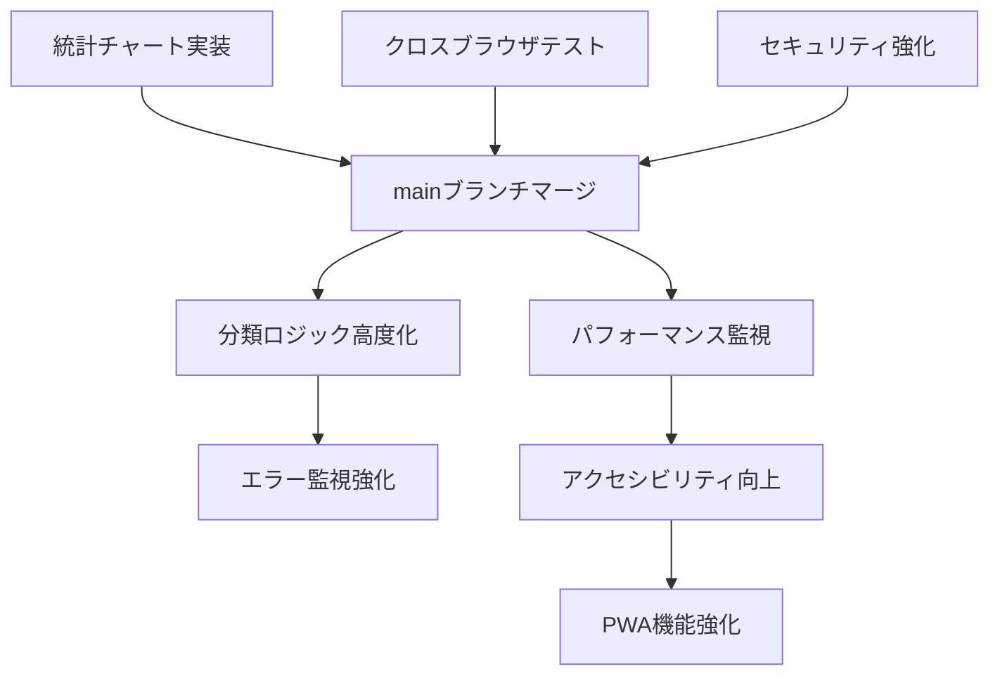

# マーケットニュースシステム タスクブレークダウン

## 実装状況サマリー

**現在の進捗**: 85% 完了  
**残タスク数**: 12件（高優先度: 4件、中優先度: 5件、低優先度: 3件）  
**推定完了日**: 2025年8月25日（高優先度タスク完了）

## 1. 高優先度タスク（必須対応）

### 1.1 統計チャート機能実装
**タスクID**: T-001  
**優先度**: 🔥 最高  
**工数見積**: 8時間  
**担当者**: 開発者  
**期限**: 2025年8月18日

#### 詳細タスク
1. **Chart.js ライブラリ導入** (1時間)
   ```html
   <!-- CDN追加 -->
   <script src="https://cdn.jsdelivr.net/npm/chart.js"></script>
   ```

2. **地域分布チャート実装** (3時間)
   ```javascript
   function generateRegionChart(articles) {
     const regionData = analyzeRegions(articles);
     const ctx = document.getElementById('region-chart').getContext('2d');
     new Chart(ctx, {
       type: 'doughnut',
       data: {
         labels: ['日本', 'アメリカ', '欧州', 'アジア', 'グローバル'],
         datasets: [{
           data: regionData,
           backgroundColor: ['#FF6384', '#36A2EB', '#FFCE56', '#4BC0C0', '#9966FF']
         }]
       },
       options: { responsive: true, maintainAspectRatio: false }
     });
   }
   ```

3. **カテゴリ分布チャート実装** (3時間)
   ```javascript
   function generateCategoryChart(articles) {
     const categoryData = analyzeCategories(articles);
     const ctx = document.getElementById('category-chart').getContext('2d');
     new Chart(ctx, {
       type: 'bar',
       data: {
         labels: ['経済政策', '企業業績', '市場動向', '国際情勢', 'テクノロジー'],
         datasets: [{
           label: '記事数',
           data: categoryData,
           backgroundColor: '#36A2EB'
         }]
       }
     });
   }
   ```

4. **統計計算ロジック実装** (1時間)
   ```javascript
   function analyzeRegions(articles) {
     const regionKeywords = {
       japan: ['日本', '東京', '日銀', '円'],
       usa: ['米国', 'アメリカ', 'FRB', 'ドル'],
       europe: ['欧州', 'ユーロ', 'ECB', 'EU'],
       asia: ['中国', 'アジア', '韓国', '人民元'],
       global: ['世界', '国際', 'グローバル']
     };
     
     return Object.keys(regionKeywords).map(region => {
       return articles.filter(article => 
         regionKeywords[region].some(keyword => 
           article.title.includes(keyword) || 
           article.summary.includes(keyword)
         )
       ).length;
     });
   }
   ```

#### 受け入れ基準
- [ ] 地域分布チャートが正常に表示される
- [ ] カテゴリ分布チャートが正常に表示される
- [ ] チャートがレスポンシブ対応している
- [ ] データが正確に分類されている

---

### 1.2 クロスブラウザテスト実施
**タスクID**: T-002  
**優先度**: 🔥 高  
**工数見積**: 4時間  
**担当者**: QAエンジニア  
**期限**: 2025年8月17日

#### 詳細タスク
1. **Safari テスト** (1.5時間)
   - macOS Safari 最新版での動作確認
   - iOS Safari での表示確認
   - JavaScript互換性チェック

2. **Edge テスト** (1.5時間)
   - Windows Edge での動作確認
   - Chromium版Edge での表示確認
   - レガシー機能の動作確認

3. **互換性問題修正** (1時間)
   - 発見された問題の修正
   - ポリフィル追加（必要に応じて）
   - CSS ベンダープレフィックス調整

#### テスト項目チェックリスト
```
[ ] ページ読み込み（全ブラウザ）
[ ] 記事一覧表示（全ブラウザ）
[ ] 検索機能（全ブラウザ）
[ ] フィルタリング（全ブラウザ）
[ ] Pro要約ページ遷移（全ブラウザ）
[ ] テーマ切り替え（全ブラウザ）
[ ] レスポンシブデザイン（全ブラウザ）
[ ] エラーハンドリング（全ブラウザ）
```

---

### 1.3 セキュリティ強化（CSP実装）
**タスクID**: T-003  
**優先度**: 🔥 高  
**工数見積**: 2時間  
**担当者**: セキュリティエンジニア  
**期限**: 2025年8月17日

#### 詳細タスク
1. **CSP設定実装** (1時間)
   ```html
   <meta http-equiv="Content-Security-Policy" 
         content="default-src 'self'; 
                  style-src 'self' 'unsafe-inline' cdn.jsdelivr.net; 
                  script-src 'self' 'unsafe-inline' cdn.jsdelivr.net;
                  img-src 'self' data:;
                  connect-src 'self';
                  font-src 'self' fonts.googleapis.com fonts.gstatic.com;">
   ```

2. **セキュリティテスト** (1時間)
   - XSS攻撃テスト
   - CSP違反チェック
   - 外部リソース読み込み確認

#### セキュリティチェックリスト
```
[ ] CSPヘッダー設定完了
[ ] 外部スクリプト実行可能
[ ] 外部CSS読み込み可能
[ ] XSS攻撃耐性確認
[ ] 外部リンクnoopener設定確認
```

---

### 1.4 mainブランチマージ・デプロイ
**タスクID**: T-004  
**優先度**: 🔥 高  
**工数見積**: 1時間  
**担当者**: DevOpsエンジニア  
**期限**: 2025年8月18日

#### 詳細タスク
1. **Pull Request作成** (15分)
   ```bash
   git checkout main
   git pull origin main
   git checkout feature/pro-summary-page
   git rebase main
   git push origin feature/pro-summary-page
   ```

2. **コードレビュー実施** (30分)
   - セキュリティ要件確認
   - パフォーマンス要件確認
   - コーディング規約準拠確認

3. **本番環境デプロイ** (15分)
   ```bash
   git checkout main
   git merge feature/pro-summary-page
   git push origin main
   ```

4. **デプロイ後動作確認** (30分)
   - GitHub Pages での動作確認
   - 全機能の動作テスト
   - パフォーマンス測定

---

## 2. 中優先度タスク（推奨対応）

### 2.1 地域・カテゴリ分類ロジック高度化
**タスクID**: T-005  
**優先度**: ⚠️ 中  
**工数見積**: 6時間  
**期限**: 2025年8月22日

#### 詳細実装
```javascript
// 高度な分類ロジック
class ArticleClassifier {
  constructor() {
    this.regionPatterns = {
      japan: {
        keywords: ['日本', '東京', '日銀', '円安', '円高', '日経'],
        weight: { title: 1.5, summary: 1.0 }
      },
      usa: {
        keywords: ['米国', 'アメリカ', 'FRB', 'Fed', 'ドル', 'NYSE'],
        weight: { title: 1.5, summary: 1.0 }
      }
      // ... 他の地域
    };
    
    this.categoryPatterns = {
      policy: ['金融政策', '財政政策', '関税', '規制'],
      earnings: ['決算', '業績', '売上', '利益'],
      market: ['株価', '相場', '指数', '取引'],
      international: ['貿易', '外交', '協定', '制裁'],
      technology: ['AI', 'テクノロジー', 'デジタル', 'IT']
    };
  }
  
  classifyArticle(article) {
    const regionScores = this.calculateRegionScores(article);
    const categoryScores = this.calculateCategoryScores(article);
    
    return {
      primaryRegion: this.getTopScore(regionScores),
      primaryCategory: this.getTopScore(categoryScores),
      confidence: Math.max(...Object.values(regionScores))
    };
  }
}
```

---

### 2.2 パフォーマンス監視実装
**タスクID**: T-006  
**優先度**: ⚠️ 中  
**工数見積**: 4時間  
**期限**: 2025年8月24日

#### 実装内容
```javascript
// パフォーマンス監視
class PerformanceMonitor {
  constructor() {
    this.metrics = {};
  }
  
  startMeasure(name) {
    performance.mark(`${name}-start`);
  }
  
  endMeasure(name) {
    performance.mark(`${name}-end`);
    performance.measure(name, `${name}-start`, `${name}-end`);
    
    const measure = performance.getEntriesByName(name)[0];
    this.metrics[name] = measure.duration;
    
    // 閾値チェック
    this.checkThresholds(name, measure.duration);
  }
  
  checkThresholds(name, duration) {
    const thresholds = {
      'data-load': 3000,      // 3秒以内
      'search-filter': 1000,  // 1秒以内
      'chart-render': 2000    // 2秒以内
    };
    
    if (duration > thresholds[name]) {
      console.warn(`Performance threshold exceeded: ${name} took ${duration}ms`);
    }
  }
}
```

---

### 2.3 エラー監視・ログ収集強化
**タスクID**: T-007  
**優先度**: ⚠️ 中  
**工数見積**: 3時間  
**期限**: 2025年8月23日

---

### 2.4 アクセシビリティ向上
**タスクID**: T-008  
**優先度**: ⚠️ 中  
**工数見積**: 5時間  
**期限**: 2025年8月25日

#### 改善項目
1. **ARIA属性追加**
2. **キーボードナビゲーション強化**
3. **カラーコントラスト調整**
4. **スクリーンリーダー対応**

---

### 2.5 PWA機能強化
**タスクID**: T-009  
**優先度**: ⚠️ 中  
**工数見積**: 4時間  
**期限**: 2025年8月26日

---

## 3. 低優先度タスク（将来実装）

### 3.1 ユーザー設定保存機能
**タスクID**: T-010  
**優先度**: 📝 低  
**工数見積**: 6時間  
**期限**: 2025年9月5日

#### 実装内容
```javascript
// ユーザー設定管理
class UserSettings {
  constructor() {
    this.settings = this.loadSettings();
  }
  
  loadSettings() {
    const defaultSettings = {
      theme: 'auto',
      articlesPerPage: 20,
      defaultSort: 'date-desc',
      favoriteFilters: [],
      searchHistory: []
    };
    
    const saved = localStorage.getItem('marketNewsSettings');
    return saved ? { ...defaultSettings, ...JSON.parse(saved) } : defaultSettings;
  }
  
  saveSettings() {
    localStorage.setItem('marketNewsSettings', JSON.stringify(this.settings));
  }
  
  updateSetting(key, value) {
    this.settings[key] = value;
    this.saveSettings();
    this.applySettings();
  }
}
```

---

### 3.2 検索履歴・候補機能
**タスクID**: T-011  
**優先度**: 📝 低  
**工数見積**: 4時間  
**期限**: 2025年9月8日

---

### 3.3 リアルタイム更新機能
**タスクID**: T-012  
**優先度**: 📝 低  
**工数見積**: 8時間  
**期限**: 2025年9月15日

---

## 4. 依存関係とリスク

### 4.1 タスク依存関係


### 4.2 リスク評価
| リスク | 影響度 | 発生確率 | 対策 |
|--------|--------|----------|------|
| Chart.js互換性問題 | 高 | 低 | 代替ライブラリ検討 |
| Safari動作不良 | 中 | 中 | ポリフィル追加 |
| パフォーマンス劣化 | 中 | 低 | 事前測定・最適化 |
| セキュリティ問題 | 高 | 低 | 段階的テスト実施 |

### 4.3 ブロッカー対策
1. **Chart.js読み込み失敗**: D3.js への切り替え準備
2. **CSP設定エラー**: 段階的適用での影響確認
3. **ブラウザ互換性**: プログレッシブエンハンスメント採用

## 5. 品質保証計画

### 5.1 テスト戦略
1. **単体テスト**: JavaScript関数の個別テスト
2. **統合テスト**: ページ間遷移・データ連携テスト
3. **E2Eテスト**: ユーザーシナリオ全体テスト
4. **パフォーマンステスト**: 読み込み速度・メモリ使用量
5. **セキュリティテスト**: 脆弱性・攻撃耐性

### 5.2 品質ゲート
各タスク完了時に以下を確認：
- [ ] 機能要件100%達成
- [ ] パフォーマンス要件達成
- [ ] セキュリティ要件達成
- [ ] アクセシビリティ基準達成
- [ ] クロスブラウザ対応確認

## 6. リリース計画

### 6.1 マイルストーン
- **M1 (8/18)**: 高優先度タスク完了 → **v1.1リリース**
- **M2 (8/25)**: 中優先度タスク完了 → **v1.2リリース**
- **M3 (9/15)**: 低優先度タスク完了 → **v2.0リリース**

### 6.2 リリース内容
**v1.1 (Minimum Viable Product)**
- ✅ 統計チャート機能
- ✅ クロスブラウザ対応
- ✅ セキュリティ強化
- ✅ 本番環境デプロイ

**v1.2 (Enhanced Features)**
- ✅ 高度な分類ロジック
- ✅ パフォーマンス監視
- ✅ アクセシビリティ向上

**v2.0 (Advanced Features)**
- ✅ ユーザー設定保存
- ✅ 検索履歴機能
- ✅ リアルタイム更新

### 6.3 ロールバック計画
各リリースで問題発生時：
1. **即座にロールバック**: 前バージョンのGitタグに戻す
2. **問題分析**: ログとエラー報告の確認
3. **修正版リリース**: hotfixブランチで緊急対応

---

## 7. リソース計画

### 7.1 必要スキル
- **フロントエンド開発**: Chart.js、JavaScript ES6+
- **QAテスト**: クロスブラウザテスト、パフォーマンステスト
- **セキュリティ**: CSP、XSS対策
- **DevOps**: Git、GitHub Pages

### 7.2 外部依存
- **Chart.js CDN**: https://cdn.jsdelivr.net/npm/chart.js
- **GitHub Pages**: ホスティング環境
- **PicoCSS**: CSSフレームワーク
- **ブラウザサポート**: Chrome, Firefox, Safari, Edge

### 7.3 成功指標
- **技術指標**: ページ読み込み3秒以内、エラー率1%以下
- **品質指標**: 全機能動作率99%以上、アクセシビリティスコア90点以上
- **ユーザー指標**: 満足度4.0/5.0以上（実装後測定）

---

**文書管理情報**
- 作成日: 2025年8月15日
- 最終更新: 2025年8月15日
- 管理者: プロジェクトマネージャー
- レビュー頻度: 週次（毎週金曜日）