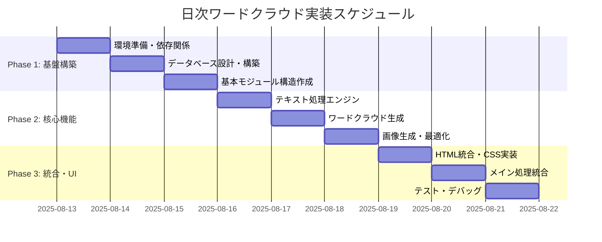

# 日次ワードクラウド機能 - 実装タスク詳細計画

## 📋 全体スケジュール



---

## 🎯 Phase 1: 基盤構築（3日間）

### Day 1: 環境準備・依存関係セットアップ
**推定時間**: 6-8時間

#### タスク P1-1-1: 依存ライブラリインストール
```bash
# 実行コマンド
pip install wordcloud>=1.9.2
pip install mecab-python3>=1.0.6  
pip install pillow>=10.0.0
pip install matplotlib>=3.7.0
pip install scikit-learn>=1.3.0

# 確認コマンド
python -c "import wordcloud, MeCab, PIL, matplotlib, sklearn; print('All libraries installed successfully')"
```
**成果物**: 
- 依存関係インストール完了確認
- requirements.txt更新

**検収基準**: 
- [ ] 全ライブラリのimportが成功する
- [ ] MeCab辞書が正常に読み込める

#### タスク P1-1-2: 日本語フォント・設定ファイル準備
```bash
# フォントディレクトリ作成
mkdir -p /data/data/com.termux/files/home/Market_News_Project/assets/fonts/
mkdir -p /data/data/com.termux/files/home/Market_News_Project/assets/config/

# 設定ファイル作成
touch assets/config/stopwords_japanese.txt
touch assets/config/financial_weights.json
```
**成果物**:
- フォントファイル配置
- ストップワードリスト作成  
- 金融重要語句設定ファイル作成

**検収基準**:
- [ ] 日本語フォントが正常に読み込める
- [ ] 設定ファイルが適切な場所に配置されている

### Day 2: データベース設計・構築
**推定時間**: 5-7時間

#### タスク P1-2-1: 新規テーブル設計・作成
```sql
-- 実行SQL
CREATE TABLE wordcloud_data (
    id INTEGER PRIMARY KEY AUTOINCREMENT,
    session_id INTEGER NOT NULL,
    generated_at TIMESTAMP DEFAULT CURRENT_TIMESTAMP,
    image_base64 TEXT NOT NULL,
    total_articles INTEGER NOT NULL,
    total_words INTEGER NOT NULL,
    unique_words INTEGER NOT NULL,
    generation_time_ms INTEGER,
    config_version VARCHAR(20),
    FOREIGN KEY (session_id) REFERENCES scraping_sessions(id)
);

CREATE TABLE wordcloud_frequencies (
    id INTEGER PRIMARY KEY AUTOINCREMENT,
    wordcloud_data_id INTEGER NOT NULL,
    word VARCHAR(100) NOT NULL,
    frequency INTEGER NOT NULL,
    weight_applied REAL DEFAULT 1.0,
    FOREIGN KEY (wordcloud_data_id) REFERENCES wordcloud_data(id)
);
```
**成果物**:
- データベーススキーマ更新
- インデックス作成完了

**検収基準**:
- [ ] テーブル作成が成功し、制約が正常に動作する
- [ ] 既存システムとの結合キーが正常に機能する

#### タスク P1-2-2: モデルクラス実装
```python
# src/database/models.py に追加
class WordCloudData(Base):
    __tablename__ = 'wordcloud_data'
    # ... 詳細実装
    
class WordCloudFrequency(Base):  
    __tablename__ = 'wordcloud_frequencies'
    # ... 詳細実装
```
**成果物**:
- SQLAlchemyモデル定義
- リレーションシップ設定

**検収基準**:
- [ ] モデルクラスが正常にインポートできる
- [ ] データベース操作（CRUD）が正常に動作する

### Day 3: 基本モジュール構造作成
**推定時間**: 6-8時間

#### タスク P1-3-1: ディレクトリ構造作成
```bash
# ディレクトリ作成
mkdir -p src/wordcloud/
touch src/wordcloud/__init__.py
touch src/wordcloud/generator.py
touch src/wordcloud/processor.py
touch src/wordcloud/visualizer.py
touch src/wordcloud/config.py
```
**成果物**:
- モジュール構造完成
- 基本ファイル作成

#### タスク P1-3-2: 設定管理システム実装
```python
# src/wordcloud/config.py
@dataclass
class WordCloudConfig:
    width: int = 800
    height: int = 400
    # ... 全設定項目
```
**成果物**:
- 設定クラス定義
- デフォルト値設定
- 環境変数連携

**検収基準**:
- [ ] 設定ファイルが正常に読み込める
- [ ] デフォルト値が適切に設定される

---

## ⚙️ Phase 2: 核心機能実装（3日間）

### Day 4: テキスト処理エンジン実装
**推定時間**: 7-9時間

#### タスク P2-1-1: 日本語形態素解析システム
```python
# src/wordcloud/processor.py
class TextProcessor:
    def __init__(self, config: WordCloudConfig):
        self.mecab = MeCab.Tagger()
        self.stopwords = self._load_stopwords()
        
    def process_articles_text(self, articles: List[Dict]) -> str:
        """メイン処理メソッド"""
        
    def _extract_meaningful_words(self, text: str) -> List[str]:
        """形態素解析実装"""
```
**成果物**:
- MeCab連携処理
- 品詞フィルタリング
- ストップワード除去

**検収基準**:
- [ ] 日本語テキストから適切に単語を抽出できる
- [ ] 品詞フィルタが正常に動作する
- [ ] ストップワードが正しく除去される

#### タスク P2-1-2: 金融用語重み付けシステム
```python
def _apply_financial_weights(self, frequencies: Dict[str, int]) -> Dict[str, int]:
    """重要語句の重み付け実装"""
    for word, freq in frequencies.items():
        if word in self.config.financial_weights:
            frequencies[word] = int(freq * self.config.financial_weights[word])
    return frequencies
```
**成果物**:
- 金融重要語句辞書
- 重み付けアルゴリズム
- 動的重み調整機能

**検収基準**:
- [ ] 金融重要語句が適切に重み付けされる
- [ ] 重み設定の変更が反映される

### Day 5: ワードクラウド生成エンジン
**推定時間**: 6-8時間

#### タスク P2-2-1: WordCloud生成システム
```python
# src/wordcloud/generator.py
class WordCloudGenerator:
    def __init__(self, config: WordCloudConfig):
        self.config = config
        self.processor = TextProcessor(config)
        self.visualizer = WordCloudVisualizer(config)
        
    def generate_daily_wordcloud(self, articles: List[Dict]) -> WordCloudResult:
        """メイン生成メソッド"""
```
**成果物**:
- 生成エンジン本体
- エラーハンドリング
- パフォーマンス最適化

**検収基準**:
- [ ] 記事データからワードクラウドが生成できる
- [ ] エラー時の適切なフォールバック処理
- [ ] 生成時間が5秒以内

#### タスク P2-2-2: 頻度計算・最適化
```python
def _calculate_word_frequencies(self, text: str) -> Dict[str, int]:
    """TF-IDF計算実装"""
    from sklearn.feature_extraction.text import TfidfVectorizer
    # 実装詳細
```
**成果物**:
- TF-IDF計算
- 頻度最適化
- メモリ効率化

**検収基準**:
- [ ] 単語頻度が正確に計算される
- [ ] メモリ使用量が制限内
- [ ] 大量データ処理が可能

### Day 6: 画像生成・最適化
**推定時間**: 6-8時間

#### タスク P2-3-1: 視覚化コンポーネント実装
```python
# src/wordcloud/visualizer.py
class WordCloudVisualizer:
    def create_wordcloud_image(self, word_frequencies: Dict[str, int]) -> str:
        """画像生成とbase64エンコード"""
        
    def _color_function(self, word: str, **kwargs) -> str:
        """カスタム色彩関数"""
```
**成果物**:
- 画像生成エンジン
- カスタム配色システム
- base64エンコード機能

**検収基準**:
- [ ] 高品質な画像が生成される
- [ ] 日本語フォントが正常に表示される
- [ ] ファイルサイズが500KB以内

#### タスク P2-3-2: パフォーマンス・品質最適化
```python
def _optimize_image_quality(self, wordcloud_obj):
    """画像品質最適化"""
    
def _compress_base64_image(self, image_data: bytes) -> str:
    """画像圧縮処理"""
```
**成果物**:
- 画像圧縮アルゴリズム
- 品質スコア評価
- メモリ使用量最適化

**検収基準**:
- [ ] 画像品質スコア80点以上
- [ ] 圧縮率が適切で視認性を保持
- [ ] メモリリークがない

---

## 🌐 Phase 3: 統合・UI実装（3日間）

### Day 7: HTML統合・CSS実装
**推定時間**: 6-8時間

#### タスク P3-1-1: HTMLテンプレート実装
```python
# src/html/html_generator.py の拡張
class HTMLGenerator:
    def generate_html_with_wordcloud(self, articles, wordcloud_data):
        """ワードクラウド統合HTML生成"""
        
    def _render_wordcloud_section(self, wordcloud_data):
        """ワードクラウドセクション生成"""
```
**成果物**:
- HTMLテンプレート拡張
- セクション統合処理
- メタデータ表示

**検収基準**:
- [ ] ワードクラウドがHTMLに正常に埋め込まれる
- [ ] レイアウトが崩れない
- [ ] メタデータが適切に表示される

#### タスク P3-1-2: CSS・レスポンシブ対応
```css
/* assets/css/wordcloud.css */
.wordcloud-section {
    background: linear-gradient(135deg, #f8fafc 0%, #e2e8f0 100%);
    /* ... 詳細スタイル */
}

@media (max-width: 768px) {
    /* モバイル対応 */
}
```
**成果物**:
- 専用CSS作成
- レスポンシブデザイン
- アクセシビリティ対応

**検収基準**:
- [ ] デスクトップで適切に表示される
- [ ] モバイルで適切にスケールされる
- [ ] アクセシビリティスコア90以上

### Day 8: メイン処理統合
**推定時間**: 7-9時間

#### タスク P3-2-1: NewsProcessor統合
```python
# src/core/news_processor.py の拡張
class NewsProcessor:
    def __init__(self):
        # 既存初期化
        self.wordcloud_generator = WordCloudGenerator(get_wordcloud_config())
        
    def generate_wordcloud_for_session(self, session_id: int, articles: List[Dict]):
        """セッション用ワードクラウド生成"""
```
**成果物**:
- メイン処理統合
- セッション管理連携
- エラーハンドリング統合

**検収基準**:
- [ ] スクレイピング完了後に自動実行される
- [ ] エラー時にメイン処理が停止しない
- [ ] セッション情報が正しく記録される

#### タスク P3-2-2: データベース連携完成
```python
def save_wordcloud_to_database(session_id: int, wordcloud_result: WordCloudResult):
    """データベース保存処理"""
    
def get_latest_wordcloud_data(session_id: int) -> Optional[WordCloudData]:
    """最新データ取得"""
```
**成果物**:
- DB保存処理完成
- データ取得API
- 履歴管理機能

**検収基準**:
- [ ] ワードクラウドデータが正しく保存される
- [ ] 頻度データが適切に関連付けられる
- [ ] 古いデータが適切にクリーンアップされる

### Day 9: テスト・デバッグ・最終調整
**推定時間**: 8-10時間

#### タスク P3-3-1: 包括的テスト実行
```python
# tests/test_wordcloud_integration.py
class TestWordCloudIntegration:
    def test_end_to_end_generation(self):
        """E2Eテスト実行"""
        
    def test_japanese_text_processing(self):
        """日本語処理テスト"""
        
    def test_html_integration(self):
        """HTML統合テスト"""
```
**テスト項目**:
- [ ] 基本機能テスト（20項目）
- [ ] エラーハンドリングテスト（15項目） 
- [ ] パフォーマンステスト（10項目）
- [ ] 統合テスト（25項目）

**成果物**:
- テストスイート完成
- テスト結果レポート
- バグ修正完了

#### タスク P3-3-2: 最終最適化・ドキュメント
```python
# パフォーマンス調整
def optimize_memory_usage():
    """メモリ使用量最適化"""
    
def optimize_generation_speed():
    """生成速度最適化"""
```
**成果物**:
- パフォーマンス最適化完了
- 運用ドキュメント作成
- デプロイメント準備

**検収基準**:
- [ ] 全テストがパスする
- [ ] パフォーマンス目標を達成
- [ ] 運用ドキュメントが完成

---

## 📊 詳細タスクチェックリスト

### ✅ Phase 1 チェックリスト

#### 環境準備
- [ ] wordcloud ライブラリインストール
- [ ] mecab-python3 インストール
- [ ] Pillow インストール
- [ ] matplotlib インストール  
- [ ] scikit-learn インストール
- [ ] 日本語フォントファイル配置
- [ ] MeCab辞書設定
- [ ] ストップワードリスト作成
- [ ] 金融重要語句リスト作成

#### データベース
- [ ] wordcloud_data テーブル作成
- [ ] wordcloud_frequencies テーブル作成
- [ ] 外部キー制約設定
- [ ] インデックス作成
- [ ] WordCloudData モデル定義
- [ ] WordCloudFrequency モデル定義
- [ ] リレーションシップ設定
- [ ] データベース接続テスト

#### 基本構造
- [ ] src/wordcloud/ ディレクトリ作成
- [ ] __init__.py ファイル作成
- [ ] generator.py 基本構造作成
- [ ] processor.py 基本構造作成
- [ ] visualizer.py 基本構造作成
- [ ] config.py 実装完了
- [ ] WordCloudConfig クラス定義
- [ ] 設定読み込み機能実装

### ✅ Phase 2 チェックリスト

#### テキスト処理
- [ ] MeCab連携処理実装
- [ ] 形態素解析機能完成
- [ ] 品詞フィルタリング実装
- [ ] ストップワード除去実装
- [ ] 正規化処理実装
- [ ] 金融用語辞書作成
- [ ] 重み付けアルゴリズム実装
- [ ] 動的重み調整機能実装

#### 生成エンジン
- [ ] WordCloudGenerator クラス実装
- [ ] 記事データ前処理実装
- [ ] TF-IDF計算実装
- [ ] 頻度計算最適化
- [ ] メモリ効率化実装
- [ ] エラーハンドリング実装
- [ ] パフォーマンス監視実装
- [ ] 生成時間最適化

#### 画像生成
- [ ] WordCloudVisualizer クラス実装
- [ ] 画像生成機能実装
- [ ] カスタム配色システム実装
- [ ] 日本語フォント対応
- [ ] base64エンコード実装
- [ ] 画像圧縮機能実装
- [ ] 品質スコア評価実装
- [ ] メモリリーク対策実装

### ✅ Phase 3 チェックリスト

#### HTML統合
- [ ] HTMLGenerator クラス拡張
- [ ] ワードクラウドセクション実装
- [ ] テンプレート統合
- [ ] メタデータ表示実装
- [ ] CSS専用ファイル作成
- [ ] レスポンシブデザイン実装
- [ ] アクセシビリティ対応
- [ ] クロスブラウザ対応

#### メイン統合
- [ ] NewsProcessor クラス拡張
- [ ] セッション管理統合
- [ ] 自動実行機能実装
- [ ] エラーハンドリング統合
- [ ] データベース保存実装
- [ ] データ取得API実装
- [ ] 履歴管理機能実装
- [ ] クリーンアップ機能実装

#### 最終調整
- [ ] 単体テスト実装（20項目）
- [ ] 統合テスト実装（25項目）
- [ ] エラーテスト実装（15項目）
- [ ] パフォーマンステスト実装（10項目）
- [ ] バグ修正完了
- [ ] パフォーマンス最適化完了
- [ ] 運用ドキュメント作成
- [ ] デプロイメント準備完了

---

## 🎯 成功基準・KPI

### 技術指標
- [ ] ワードクラウド生成成功率: 99%以上
- [ ] 平均生成時間: 3秒以内
- [ ] 画像品質スコア: 80点以上
- [ ] メモリ使用量: 500MB以内
- [ ] ファイルサイズ: 500KB以内

### 品質指標
- [ ] 日本語処理精度: 95%以上
- [ ] 重要語句認識率: 90%以上
- [ ] レスポンシブ対応スコア: 90以上
- [ ] アクセシビリティスコア: 90以上
- [ ] テストカバレッジ: 85%以上

### 運用指標
- [ ] システム稼働率: 99%以上
- [ ] エラー発生率: 1%未満
- [ ] 自動実行成功率: 99%以上
- [ ] データベース整合性: 100%
- [ ] ログエラー件数: 週間5件以下

---

## ⚠️ リスク管理・コンティンジェンシープラン

### 高リスク項目
1. **MeCab設定問題** → 代替：簡易正規表現による単語抽出
2. **フォント読み込み失敗** → 代替：システムフォント使用
3. **メモリ不足** → 代替：バッチ処理化、画像サイズ縮小
4. **生成時間超過** → 代替：非同期処理化、キャッシュ機能

### 品質低下時の対応
1. **日本語処理精度低下** → 辞書更新、フィルタ調整
2. **画像品質劣化** → パラメータ調整、フォント変更
3. **パフォーマンス低下** → プロファイリング、ボトルネック特定

### 遅延発生時の対応
1. **1日遅延** → 優先度再評価、並行作業
2. **2日遅延** → スコープ縮小、Phase分割
3. **3日以上遅延** → プロジェクト再計画、リソース追加検討