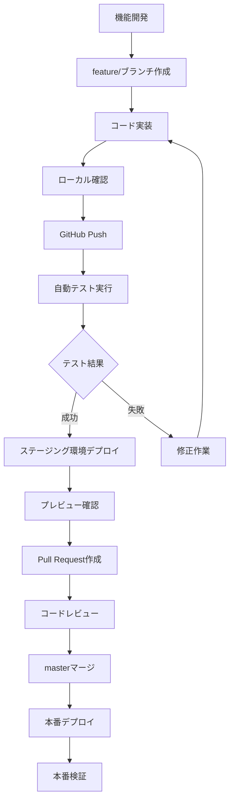

# CI/CD運用ガイド

## 概要

このプロジェクトでは、GitHub Actionsを使用した包括的なCI/CDパイプラインを構築しています。Termux環境でのローカルテストの制約を克服し、信頼性の高い自動テスト・デプロイメントシステムを提供します。

## ワークフロー構成

### 1. テストワークフロー (`test.yml`)

**目的**: 包括的なテスト実行とコード品質検証

**トリガー**:
- `push`: すべてのブランチ
- `pull_request`: master/main/developブランチ向け
- 手動実行

**ステージ**:
1. **コード品質チェック** - Black, Flake8, MyPy
2. **ユニットテスト** - Python 3.9, 3.10, 3.11
3. **統合テスト** - 実際のAPIとの統合テスト
4. **カバレッジ分析** - テストカバレッジの測定・報告

**使用方法**:
```bash
# 手動実行（全テスト）
gh workflow run test.yml

# 特定のテストレベルのみ実行
gh workflow run test.yml -f test_level=unit

# カバレッジ閾値指定
gh workflow run test.yml -f coverage_threshold=85
```

### 2. ステージングデプロイ (`staging-deployment.yml`)

**目的**: 開発ブランチのステージング環境デプロイ

**トリガー**:
- `push`: develop, feature/*, fix/*ブランチ
- `pull_request`: master/main/developブランチ向け
- 手動実行

**機能**:
- テスト実行後のステージング環境デプロイ
- ブランチ別のプレビュー環境作成
- PR作成時の自動コメント（プレビューURL付き）

**ステージングURL**:
```
https://[repository_owner].github.io/[repository_name]/staging/[branch_name]/
```

### 3. 完全CI/CDパイプライン (`ci-cd-pipeline.yml`)

**目的**: プロダクション向け完全統合パイプライン

**トリガー**:
- `push`: masterブランチ
- 手動実行

**ステージ**:
1. 包括的テスト実行
2. セキュリティスキャン（Bandit, Safety）
3. パフォーマンステスト
4. プロダクション準備確認
5. プロダクションデプロイ
6. ポッドキャスト配信（オプション）
7. デプロイ後検証

### 4. 本番運用ワークフロー

#### メインワークフロー (`main.yml`)
- **拡張機能**: テスト結果確認機能追加
- **デプロイ前検証**: GitHub CLIを使用した最新テスト結果確認
- **エラーハンドリング**: 詳細な診断情報とIssue自動作成

#### ポッドキャストワークフロー (`podcast-broadcast.yml`)
- **拡張機能**: ヘルスチェック機能追加
- **依存関係テスト**: 実行前の基本モジュール確認
- **Google Cloud TTS診断**: 認証・API状態の詳細確認

### 5. 監視・ヘルスチェック (`monitoring.yml`)

**目的**: 本番環境の継続的監視

**スケジュール**: 毎時0分・30分

**監視項目**:
- HTTPアクセス状態
- レスポンス時間
- コンテンツ整合性
- RSSフィード状態（ポッドキャスト）
- パフォーマンス評価

**アラート機能**:
- 重大問題検出時の自動Issue作成
- ヘルススコア算出（100点満点）
- 詳細レポートのArtifact保存

## 環境構成

### ステージング環境

**URL形式**: `https://[owner].github.io/[repo]/staging/[branch]/`

**特徴**:
- ブランチ別の独立環境
- テスト結果と連動
- PRプレビュー機能
- 自動クリーンアップ

### プロダクション環境

**URL**: `https://[owner].github.io/[repo]/`

**デプロイ条件**:
- masterブランチからのプッシュ
- 全テスト成功
- セキュリティスキャン通過
- 手動承認（重要変更時）

## 開発フロー

### 標準的な開発フロー



### ブランチ運用

```
master (本番)
├── develop (開発統合)
├── feature/新機能名 (機能開発)
├── fix/修正内容 (バグ修正)
└── hotfix/緊急修正 (緊急対応)
```

## 運用手順

### 1. 新機能開発

```bash
# 1. ブランチ作成
git checkout -b feature/new-feature develop

# 2. 開発・コミット
git add .
git commit -m "feat: 新機能の実装"

# 3. プッシュ（自動テスト・ステージングデプロイ）
git push origin feature/new-feature

# 4. ステージング環境で確認
# https://[owner].github.io/[repo]/staging/feature/new-feature/

# 5. PR作成・マージ
gh pr create --title "新機能追加" --base develop
```

### 2. 本番リリース

```bash
# 1. developからmasterにPR作成
gh pr create --title "v1.2.0 リリース" --base master --head develop

# 2. 完全CI/CDパイプライン実行（自動）
# または手動トリガー
gh workflow run ci-cd-pipeline.yml

# 3. デプロイ完了確認
gh run list --workflow=ci-cd-pipeline.yml
```

### 3. 緊急修正

```bash
# 1. hotfixブランチ作成
git checkout -b hotfix/critical-fix master

# 2. 修正・テスト
git commit -m "fix: 緊急修正"

# 3. 直接masterにPR（レビュー省略可）
gh pr create --title "緊急修正" --base master

# 4. 強制デプロイ（必要時）
gh workflow run ci-cd-pipeline.yml -f force_deploy=true
```

### 4. 監視とトラブルシューティング

#### ヘルスチェック確認

```bash
# 手動ヘルスチェック実行
gh workflow run monitoring.yml

# 最新の監視結果確認
gh run list --workflow=monitoring.yml --limit=5
```

#### 問題発生時の対応

1. **監視アラート確認**
   - GitHub Issues の `critical`, `monitoring` ラベル確認
   - ヘルススコア・詳細レポート分析

2. **問題切り分け**
   ```bash
   # 最新デプロイメント状況確認
   gh run list --workflow=main.yml --limit=3
   
   # テスト結果確認
   gh run list --workflow=test.yml --limit=3
   
   # 本番サイト直接確認
   curl -I https://[owner].github.io/[repo]/
   ```

3. **復旧手順**
   ```bash
   # 安全な版への復旧（前回の成功コミット）
   git checkout [last_good_commit]
   gh workflow run main.yml
   
   # または強制再デプロイ
   gh workflow run ci-cd-pipeline.yml -f force_deploy=true
   ```

## 設定管理

### 必要な環境変数

#### GitHub Secrets（リポジトリ設定）

**基本認証**:
- `GEMINI_API_KEY`: Gemini AI API キー
- `GOOGLE_OAUTH2_CLIENT_ID`: Google OAuth2 クライアントID
- `GOOGLE_OAUTH2_CLIENT_SECRET`: Google OAuth2 クライアントシークレット
- `GOOGLE_OAUTH2_REFRESH_TOKEN`: Google OAuth2 リフレッシュトークン

**ポッドキャスト機能**:
- `GOOGLE_APPLICATION_CREDENTIALS_JSON`: Google Cloud TTS サービスアカウントJSON
- `LINE_CHANNEL_ACCESS_TOKEN`: LINE Bot アクセストークン（任意）
- `PODCAST_RSS_BASE_URL`: ポッドキャストRSSベースURL

**デプロイ設定**:
- `GOOGLE_DRIVE_OUTPUT_FOLDER_ID`: Google Drive 出力フォルダID
- `GOOGLE_OVERWRITE_DOC_ID`: Google Docs 上書き対象ID

### ワークフロー設定のカスタマイズ

#### テスト設定

`.github/workflows/test.yml` の修正例:
```yaml
# カバレッジ閾値変更
coverage_threshold: '75'  # デフォルト80%から変更

# テスト対象Pythonバージョン追加
strategy:
  matrix:
    python-version: ['3.9', '3.10', '3.11', '3.12']
```

#### 監視設定

`.github/workflows/monitoring.yml` の修正例:
```yaml
# 監視間隔変更（毎15分）
schedule:
  - cron: '*/15 * * * *'

# アラート閾値変更
alert_threshold: '5'  # レスポンス時間5秒でアラート
```

## 最適化とメンテナンス

### パフォーマンス最適化

1. **並列実行の活用**
   - 複数テストジョブの並列実行
   - ステージング・本番デプロイの効率化

2. **キャッシュ戦略**
   - Python依存関係のキャッシュ
   - ビルドアーティファクトの再利用

3. **タイムアウト設定**
   - 適切なタイムアウト値設定
   - 無限待機の防止

### セキュリティ強化

1. **認証情報管理**
   - GitHub Secrets の定期的な更新
   - 最小権限の原則適用

2. **脆弱性監視**
   - 定期的な依存関係更新
   - セキュリティスキャンの継続実行

3. **アクセス制御**
   - ブランチ保護ルール設定
   - 必要最小限のワークフロー権限

## トラブルシューティング

### よくある問題と解決方法

#### 1. テスト失敗

**症状**: テストワークフローが失敗する
**原因**: 依存関係・環境設定・コードエラー
**解決**:
```bash
# ローカルでのテスト実行（可能な場合）
python -m pytest tests/ -v

# 依存関係の更新
pip install -r requirements.txt --upgrade

# 特定テストのみ実行
gh workflow run test.yml -f test_level=unit
```

#### 2. デプロイ失敗

**症状**: 本番デプロイが失敗する
**原因**: 権限・設定・GitHub Pages問題
**解決**:
```bash
# GitHub Pages設定確認
gh api repos/:owner/:repo/pages

# 強制再デプロイ
gh workflow run main.yml

# 権限確認（リポジトリ設定）
Settings > Actions > General > Workflow permissions
```

#### 3. 監視アラート

**症状**: ヘルスチェックでエラーが継続発生
**原因**: サービス障害・設定問題・ネットワーク問題
**解決**:
```bash
# 手動サイト確認
curl -v https://[owner].github.io/[repo]/

# DNS確認
nslookup [owner].github.io

# GitHub Pages状態確認
https://www.githubstatus.com/
```

#### 4. ポッドキャスト機能エラー

**症状**: ポッドキャスト生成が失敗する
**原因**: Google Cloud TTS認証・API制限・音声処理エラー
**解決**:
```bash
# TTS接続テスト実行
gh workflow run podcast-broadcast.yml -f test_mode=true

# 認証情報確認
# GOOGLE_APPLICATION_CREDENTIALS_JSON の内容チェック

# API quota確認
# Google Cloud Console で利用状況確認
```

## 継続的改善

### メトリクス監視

1. **テスト実行時間**: 長期間のトレンド監視
2. **デプロイ頻度**: リリースサイクル最適化
3. **失敗率**: 品質向上指標
4. **復旧時間**: インシデント対応改善

### フィードバックループ

1. **週次レビュー**: ワークフロー実行状況確認
2. **月次改善**: 設定・プロセス最適化
3. **四半期評価**: 全体戦略見直し

この運用ガイドに従って、効率的で信頼性の高いCI/CDパイプラインを維持・改善していってください。