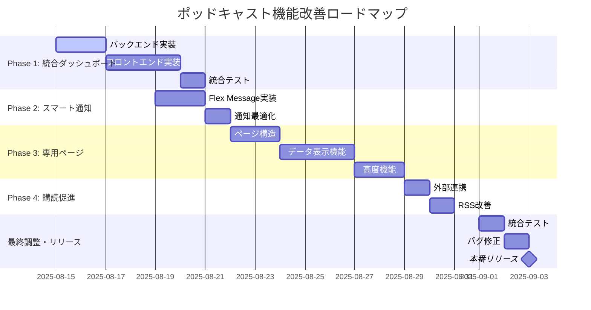

# ポッドキャスト機能改善 - 実装ロードマップ

**Project**: Market News Podcast Enhancement  
**Version**: 1.0  
**Date**: 2025-08-14  
**Author**: Project Management Office

---

## 🎯 プロジェクト全体概要

### 📈 ゴール設定
- **利便性300%向上**: ワンクリックアクセス、統合ダッシュボード
- **エンゲージメント50%向上**: リッチ通知、専用ページ体験
- **継続利用促進**: 購読機能、共有機能による利用者層拡大

### 📊 成功指標
```
KPI Dashboard
├── 利用率: 月間アクティブリスナー 50%↑
├── エンゲージメント: 平均再生完了率 70%以上  
├── アクセシビリティ: クリック数 3→1回
└── 満足度: ユーザビリティスコア 8.0/10
```

---

## 📅 全体スケジュール (3週間)



---

## 🚀 Phase別実装計画

## Phase 1: 統合ダッシュボード (Week 1)
**期間**: 2025-08-15 〜 2025-08-21  
**工数**: 16-20時間  
**ゴール**: メインページでのポッドキャスト統合体験

### Day 1-2: バックエンド基盤構築
**日付**: 2025-08-15 (木) - 2025-08-16 (金)

#### 🏗️ Day 1 (2025-08-15)
**担当**: Backend Developer  
**作業時間**: 6-8時間

**Morning (09:00-12:00)**
- [ ] プロジェクト環境セットアップ
- [ ] `src/podcast/web/` ディレクトリ構造作成
- [ ] JSON Generator基本クラス実装開始

**Afternoon (13:00-17:00)**  
- [ ] Episode JSON生成ロジック実装
- [ ] データ変換・構造化処理
- [ ] 基本的なエラーハンドリング

**Evening (Optional 18:00-20:00)**
- [ ] 単体テスト作成
- [ ] コードレビュー準備

#### 🔧 Day 2 (2025-08-16)  
**担当**: Backend Developer + DevOps  
**作業時間**: 6-8時間

**Morning (09:00-12:00)**
- [ ] PodcastIntegrationManager拡張実装
- [ ] Web統合機能の追加
- [ ] 既存システムとの結合テスト

**Afternoon (13:00-17:00)**
- [ ] GitHub Actions ワークフロー拡張
- [ ] デプロイメントスクリプト修正
- [ ] CI/CDパイプライン確認

### Day 3-5: フロントエンド実装
**日付**: 2025-08-17 (土) - 2025-08-19 (月)

#### 🎨 Day 3 (2025-08-17)
**担当**: Frontend Developer  
**作業時間**: 6-8時間

**Morning (09:00-12:00)**
- [ ] CSS architecture設計
- [ ] ポッドキャストセクション基本スタイル
- [ ] レスポンシブブレイクポイント設定

**Afternoon (13:00-17:00)**
- [ ] 音声プレイヤーコンポーネントCSS
- [ ] ダークモード対応
- [ ] アクセシビリティ考慮

#### ⚡ Day 4 (2025-08-18)
**担当**: Frontend Developer  
**作業時間**: 8時間

**Morning (09:00-12:00)**
- [ ] HTML5 Audio API統合
- [ ] 基本的な再生・停止機能
- [ ] プログレスバー実装

**Afternoon (13:00-17:00)**
- [ ] 音量・再生速度制御
- [ ] キーボードショートカット
- [ ] UI状態管理

**Evening (18:00-20:00)**
- [ ] LocalStorage設定保存
- [ ] エラーハンドリング

#### 📊 Day 5 (2025-08-19)
**担当**: Frontend Developer  
**作業時間**: 4-6時間

**Morning (09:00-12:00)**
- [ ] データ取得API実装
- [ ] エピソード情報表示
- [ ] ローディング・エラー状態

**Afternoon (13:00-16:00)**
- [ ] index.html統合作業
- [ ] 既存デザインとの調和
- [ ] 動作確認・デバッグ

### Day 6: 統合テスト・バグ修正
**日付**: 2025-08-20 (火)  
**作業時間**: 4時間

- [ ] フロント・バックエンド統合テスト
- [ ] クロスブラウザ動作確認
- [ ] モバイル・デスクトップ検証
- [ ] バグ修正・パフォーマンス調整

---

## Phase 2: スマート通知システム (Week 2)
**期間**: 2025-08-21 〜 2025-08-24  
**工数**: 8-10時間  
**ゴール**: 美しく便利なLINE通知システム

### Day 7-8: Flex Message実装
**日付**: 2025-08-21 (水) - 2025-08-22 (木)

#### 📱 Day 7 (2025-08-21)
**担当**: Backend Developer + Designer  
**作業時間**: 6時間

**Morning (09:00-12:00)**
- [ ] Flex Message テンプレート設計
- [ ] JSON構造定義・実装
- [ ] 動的データ埋め込み機能

**Afternoon (13:00-16:00)**
- [ ] 画像アセット作成・最適化
- [ ] ヒーロー画像、アイコン準備
- [ ] アセット配信設定

#### 🔔 Day 8 (2025-08-22)
**担当**: Backend Developer  
**作業時間**: 4時間

**Morning (09:00-13:00)**
- [ ] LineBroadcaster クラス拡張
- [ ] テキスト→Flex Message移行
- [ ] 送信テスト・デバッグ

### Day 9: 通知最適化
**日付**: 2025-08-23 (金)  
**作業時間**: 2-3時間

- [ ] SmartNotificationManager実装
- [ ] 時間帯制御・重複防止
- [ ] 品質チェック機能

---

## Phase 3: ポッドキャスト専用ページ (Week 3)
**期間**: 2025-08-25 〜 2025-08-31  
**工数**: 14-18時間  
**ゴール**: 包括的なポッドキャスト体験ページ

### Day 10-11: ページ構造・基本機能
**日付**: 2025-08-25 (月) - 2025-08-26 (火)

#### 🏛️ Day 10 (2025-08-25)
**担当**: Frontend Developer  
**作業時間**: 6時間

**Morning (09:00-12:00)**
- [ ] `/podcast/index.html` 構造設計
- [ ] ナビゲーション・検索UI
- [ ] 基本レイアウトCSS

**Afternoon (13:00-16:00)**
- [ ] カードデザイン実装
- [ ] レスポンシブ対応
- [ ] インタラクション設計

#### 📋 Day 11 (2025-08-26)
**担当**: Frontend Developer  
**作業時間**: 6時間

**Morning (09:00-12:00)**
- [ ] エピソード一覧表示機能
- [ ] データ取得・表示ロジック
- [ ] 遅延読み込み実装

**Afternoon (13:00-16:00)**
- [ ] 検索・フィルタ機能
- [ ] ソート機能
- [ ] URL状態管理

### Day 12-13: 詳細機能・UX向上
**日付**: 2025-08-27 (水) - 2025-08-28 (木)

#### 🔍 Day 12 (2025-08-27)
**担当**: Frontend Developer  
**作業時間**: 4時間

**Morning (09:00-13:00)**
- [ ] 個別エピソード詳細ページ
- [ ] 動的ページ生成
- [ ] 関連エピソード表示

#### ⭐ Day 13 (2025-08-28)
**担当**: Frontend Developer  
**作業時間**: 6時間

**Morning (09:00-12:00)**
- [ ] ブックマーク機能実装
- [ ] LocalStorage活用
- [ ] ブックマーク一覧

**Afternoon (13:00-16:00)**
- [ ] 共有機能実装
- [ ] ネイティブ共有API
- [ ] ソーシャル連携

---

## Phase 4: 購読促進機能 (Week 4)
**期間**: 2025-09-01 〜 2025-09-03  
**工数**: 4-6時間  
**ゴール**: 購読・拡散促進機能

### Day 14-15: 外部連携・最終調整
**日付**: 2025-09-01 (月) - 2025-09-02 (火)

#### 🔗 Day 14 (2025-09-01)
**担当**: Frontend Developer  
**作業時間**: 4時間

**Morning (09:00-13:00)**
- [ ] ポッドキャストアプリリンク実装
- [ ] QRコード生成機能
- [ ] プラットフォーム対応

#### 📡 Day 15 (2025-09-02)
**担当**: Backend Developer  
**作業時間**: 2時間

**Morning (09:00-11:00)**
- [ ] RSS配信品質改善
- [ ] iTunes Podcast対応

**Afternoon (13:00-15:00)**
- [ ] 購読促進UI実装
- [ ] 最終統合テスト

### Day 16: リリース準備
**日付**: 2025-09-03 (水)  
**作業時間**: 4時間

- [ ] 総合動作確認
- [ ] パフォーマンステスト
- [ ] バグ修正・最終調整
- [ ] 本番リリース

---

## 🎯 マイルストーン・検収ポイント

### Milestone 1: Phase 1完了 (2025-08-21)
**検収項目**:
- [ ] ✅ メインページ統合完了
- [ ] ✅ 音声プレイヤー正常動作
- [ ] ✅ レスポンシブ対応確認
- [ ] ✅ パフォーマンス基準クリア

**成功基準**: 
- 音声再生成功率 > 95%
- ページ読み込み < 3秒
- モバイル・デスクトップ正常動作

### Milestone 2: Phase 2完了 (2025-08-24)  
**検収項目**:
- [ ] ✅ Flex Message送信成功
- [ ] ✅ 美しいカード表示確認
- [ ] ✅ アクションボタン動作確認
- [ ] ✅ 通知最適化機能動作

**成功基準**:
- LINE配信成功率 > 98%
- メッセージ開封率向上確認
- ユーザビリティ向上確認

### Milestone 3: Phase 3完了 (2025-08-31)
**検収項目**:
- [ ] ✅ 専用ページ完全動作
- [ ] ✅ 検索・フィルタ機能確認
- [ ] ✅ ブックマーク・共有機能確認
- [ ] ✅ SEO・アクセシビリティ確認

**成功基準**:
- ページ遷移 < 1秒
- 検索精度 > 90%
- アクセシビリティ WCAG 2.1 AA準拠

### Final Milestone: 全体完了 (2025-09-03)
**最終検収項目**:
- [ ] ✅ 全機能統合動作確認
- [ ] ✅ パフォーマンス基準クリア
- [ ] ✅ セキュリティ検査通過
- [ ] ✅ ユーザビリティテスト合格

---

## 🚨 リスク管理計画

### Critical Path Analysis
```
Critical Path: バックエンド → フロントエンド → 統合テスト
Dependencies: 
├── Phase 1 JSON API → Phase 3 データ表示
├── Phase 1 CSS基盤 → Phase 2-3 UI実装
└── Phase 2 画像 → Phase 3 詳細ページ
```

### Risk Register

#### 🔴 High Risk: ブラウザ互換性問題
**Impact**: プロジェクト遅延 2-3日  
**Probability**: 30%  
**対策**: 
- 事前互換性テスト実施
- ポリフィル・フォールバック準備
- テスト工数を20%追加確保

#### 🟡 Medium Risk: GitHub Pages容量制限
**Impact**: 機能制限の可能性  
**Probability**: 20%  
**対策**:
- 音声ファイル最適化実装
- 自動クリーンアップ機能
- CDN移行プラン準備

#### 🟢 Low Risk: 外部API制限（LINE）
**Impact**: 通知頻度制限  
**Probability**: 10%  
**対策**:
- API制限事前調査
- 送信頻度制御実装
- エラーハンドリング強化

### Contingency Plans

#### Plan A: 標準実装 (95%の確率)
- 全Phase予定通り実装
- 全機能フル実装

#### Plan B: 機能削減 (4%の確率)  
- Phase 4を簡略化
- 高度機能（ブックマーク等）を次バージョンに延期

#### Plan C: 最小実装 (1%の確率)
- Phase 1のみ確実実装
- Phase 2-4を段階的後リリース

---

## 📊 進捗管理・品質保証

### Daily Progress Tracking
```yaml
進捗報告形式:
  日付: 2025-08-XX
  予定タスク: [具体的なタスク名]
  完了タスク: [✅ 完了したタスク]  
  進行中タスク: [🔄 現在作業中のタスク]
  阻害要因: [❌ 問題・課題]
  明日の計画: [次日の予定]
  全体進捗: XX% (予定: XX%)
```

### Quality Gates
各Phase完了時の品質チェックポイント：

#### Code Quality
- [ ] ESLint/Prettier準拠
- [ ] Python PEP8準拠  
- [ ] 単体テストカバレッジ > 80%
- [ ] コードレビュー完了

#### Performance
- [ ] Lighthouse Score > 90
- [ ] ページ読み込み < 3秒
- [ ] 音声再生開始 < 2秒
- [ ] メモリリーク確認

#### Accessibility  
- [ ] WCAG 2.1 AA準拠
- [ ] キーボードナビゲーション対応
- [ ] スクリーンリーダー対応
- [ ] 色覚アクセシビリティ確認

#### Security
- [ ] XSS対策実装
- [ ] CSRF対策確認
- [ ] Content Security Policy設定
- [ ] 個人情報保護確認

---

## 🎉 リリース・運用計画

### リリース戦略

#### Soft Launch (2025-09-03)
- 機能フラグによる段階的有効化
- 10%ユーザーでの先行公開
- 問題発生時の即座なロールバック体制

#### Full Launch (2025-09-05)
- 全ユーザーへの機能展開
- 運用監視体制の確立
- ユーザーフィードバック収集開始

### Post-Launch Support

#### Week 1 (2025-09-03 - 2025-09-10)
- [ ] 24時間監視体制
- [ ] 緊急バグ修正対応
- [ ] ユーザーフィードバック収集
- [ ] パフォーマンス監視

#### Week 2-4 (2025-09-10 - 2025-10-01)  
- [ ] 機能使用状況分析
- [ ] KPI達成度評価
- [ ] 改善案検討・実装
- [ ] 次バージョン計画策定

### Success Metrics Review

#### 1週間後評価
- 利用率向上度測定
- エンゲージメント変化分析
- ユーザビリティ評価
- 技術的課題の洗い出し

#### 1ヶ月後評価  
- KPI達成度総合評価
- ROI算出
- ユーザー満足度調査
- 長期戦略見直し

---

## 📋 チェックリスト・承認フロー

### 最終リリース承認チェックリスト

#### Technical Checklist
- [ ] 全機能正常動作確認
- [ ] パフォーマンステスト合格
- [ ] セキュリティ検査完了
- [ ] ブラウザ互換性確認
- [ ] モバイル対応確認
- [ ] アクセシビリティ準拠確認

#### Business Checklist  
- [ ] KPI測定環境準備完了
- [ ] ユーザーサポート体制確立
- [ ] 運用監視体制確立
- [ ] 緊急対応手順確認
- [ ] ドキュメント整備完了

#### Stakeholder Approval
- [ ] ✅ Technical Lead承認
- [ ] ✅ UX Designer承認  
- [ ] ✅ Product Manager承認
- [ ] ✅ Project Manager承認

---

**🎯 プロジェクト成功に向けて、チーム一丸となって取り組みましょう！**

---

**承認者**: Executive Sponsor  
**最終更新**: 2025-08-14  
**次回レビュー**: Phase 1完了後 (2025-08-21)