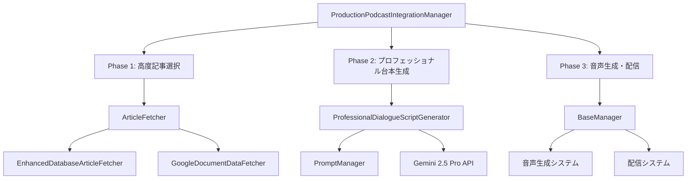

# ポッドキャスト台本生成プロセス詳細レポート

## 概要

このドキュメントは、Market Newsポッドキャストシステムにおける台本生成プロセスの詳細を記載します。現在のシステムは、記事選択から台本生成、音声配信まで3つのフェーズで構成された高度な自動化システムです。

**生成日時:** 2025年08月21日  
**対象システム:** ProductionPodcastIntegrationManager  
**使用AI:** Gemini 2.5 Pro  

---

## システム全体アーキテクチャ



**主要コンポーネント:**
- **統合管理**: `ProductionPodcastIntegrationManager` (`src/podcast/integration/production_podcast_integration_manager.py`)
- **台本生成**: `ProfessionalDialogueScriptGenerator` (`src/podcast/script_generation/professional_dialogue_script_generator.py`)
- **プロンプト管理**: `PromptManager` (`src/podcast/prompts/prompt_manager.py`)
- **記事取得**: データベース/Googleドキュメント対応

---

## Phase 1: 高度記事選択プロセス

**処理場所:** `production_podcast_integration_manager.py:250`

### 1-1. 記事取得実行
```python
articles = self.article_fetcher.fetch_articles_for_podcast(
    target_count=6, hours_back=24
)
```

**パラメータ:**
- `target_count`: 6記事（設定可能）
- `hours_back`: 24時間以内の記事を対象
- `data_source`: database | google_document

### 1-2. データソース別処理

#### データベースモード
**実装:** `EnhancedDatabaseArticleFetcher` (`src/podcast/data_fetcher/enhanced_database_article_fetcher.py`)
- データベースからの高度記事検索
- スコアリングアルゴリズムによる重要度判定
- カテゴリ別・地域別フィルタリング

#### Googleドキュメントモード  
**実装:** `GoogleDocumentDataFetcher` (`src/podcast/data_fetcher/google_document_data_fetcher.py`)
- Google Document APIからのデータ取得
- 構造化データの解析・変換
- 記事スコアリング適用

### 1-3. 記事選択結果
**出力形式:** `List[ArticleScore]`
- 記事本文とメタデータ
- 重要度スコア
- カテゴリ・地域分類
- 配信日時情報

---

## Phase 2: プロフェッショナル台本生成プロセス

**処理場所:** `professional_dialogue_script_generator.py:59-139`

### 2-1. プロンプトパターン決定
```python
if prompt_pattern is None:
    prompt_pattern = self.prompt_manager.get_environment_prompt_pattern()
```

**利用可能パターン:**
- `enhanced_persona`: 強化されたペルソナベース
- `minimalist`: ミニマルスタイル
- `context_aware`: コンテキスト重視
- `cot_enhanced`: 思考連鎖強化版
- `constraint_optimization`: 制約最適化
- `current_professional`: 現行プロフェッショナル版
- `few_shot_learning`: 少数ショット学習

### 2-2. 記事情報準備
**メソッド:** `_prepare_article_summaries(articles)`

**変換内容:**
- 記事タイトル・要約の構造化
- カテゴリ・地域情報の整理
- 重要度スコアの正規化
- 配信日時のフォーマット

### 2-3. 動的プロンプト生成
**メソッド:** `_create_dynamic_prompt()` (`line:172-225`)

**テンプレート変数:**
```python
template_vars = {
    "target_duration": target_duration,           # 目標時間（分）
    "target_chars": target_chars,                 # 目標文字数
    "target_chars_min": target_chars - 100,       # 最小文字数
    "target_chars_max": target_chars + 100,       # 最大文字数
    "main_content_chars": target_chars - 400,     # メインコンテンツ文字数
    "articles_data": articles_text,               # 構造化記事データ
    "generation_date": datetime.now().strftime('%Y年%m月%d日・%A'),
    "episode_number": self._generate_episode_number(),
}
```

**文字数計算:**
- 1分あたり約280文字（情報密度向上版）
- メインコンテンツ = 総文字数 - 400文字（オープニング・クロージング分）

### 2-4. Gemini API呼び出し
```python
response = self.model.generate_content(
    prompt,
    generation_config=genai.types.GenerationConfig(**generation_config),
)
```

**使用モデル:** Gemini 2.5 Pro
**生成設定:** プロンプトパターン別に最適化された設定値

### 2-5. 品質評価・調整プロセス
1. **初期品質評価**: `_evaluate_script_quality(raw_script)`
2. **品質調整**: `_adjust_script_quality(raw_script, quality_result)`  
3. **最終品質確認**: 調整後スクリプトの再評価

**品質指標:**
- 文字数適合度
- 推定配信時間
- 総合品質スコア
- 品質詳細分析

---

## Phase 3: 音声生成・配信プロセス

**処理場所:** `production_podcast_integration_manager.py:265-285`

### 3-1. 一時ファイル作成
```python
script_content = script_result["script"]
temp_script_path = Path("temp_podcast_script.txt")
with open(temp_script_path, "w", encoding="utf-8") as f:
    f.write(script_content)
```

### 3-2. 既存システム連携
```python
if self.base_manager:
    broadcast_result = self.base_manager.run_daily_podcast_workflow(
        test_mode=test_mode, 
        custom_script_path=str(temp_script_path)
    )
```

**base_manager機能:**
- 音声合成処理
- ポッドキャスト配信
- メタデータ管理

### 3-3. クリーンアップ処理
```python
finally:
    if temp_script_path.exists():
        temp_script_path.unlink()
```

---

## プロンプト管理システム詳細

**実装場所:** `src/podcast/prompts/prompt_manager.py`

### テンプレート構造
```
src/podcast/prompts/templates/
├── enhanced_persona.txt
├── minimalist.txt
├── context_aware.txt
├── cot_enhanced.txt
├── constraint_optimization.txt
├── current_professional.txt
└── few_shot_learning.txt
```

### 設定管理
```
src/podcast/prompts/configs/
└── prompt_configs.yaml
```

### 主要機能
- **テンプレート読み込み**: `load_prompt_template(pattern, **template_vars)`
- **環境設定取得**: `get_environment_prompt_pattern()`
- **生成設定管理**: `get_generation_config(prompt_pattern)`
- **結果ログ**: `log_generation_result(prompt_pattern, result)`

---

## データ取得システム比較

| 項目 | データベースモード | Googleドキュメントモード |
|------|------------------|------------------------|
| **実装クラス** | `EnhancedDatabaseArticleFetcher` | `GoogleDocumentDataFetcher` |
| **データソース** | PostgreSQL/MySQL | Google Document API |
| **記事取得方式** | SQL クエリベース | Document解析ベース |
| **リアルタイム性** | 高い | 中程度 |
| **スケーラビリティ** | 高い | 制限あり |
| **設定複雑度** | 中程度 | 低い |
| **用途** | プロダクション環境 | テスト・プロトタイプ |

### 環境変数設定
```bash
# データベースモード
PODCAST_DATA_SOURCE=database

# Googleドキュメントモード  
PODCAST_DATA_SOURCE=google_document
GOOGLE_DOCUMENT_ID=your_document_id
```

---

## 処理結果・品質管理

### 生成結果構造
```python
result = {
    "success": bool,                          # 処理成功可否
    "production_mode": bool,                  # プロダクションモード
    "test_mode": bool,                        # テストモード
    "script_generation": {                    # 台本生成結果
        "script": str,                        # 生成された台本
        "char_count": int,                    # 文字数
        "estimated_duration": float,          # 推定配信時間
        "quality_score": float,               # 品質スコア
        "generation_model": str,              # 使用モデル
        "prompt_pattern": str,                # 使用プロンプトパターン
    },
    "articles_analysis": {                    # 記事分析結果
        "selected_count": int,                # 選択記事数
        "data_source": str,                   # データソース
        "article_scores": List[dict],         # 記事別スコア
    },
    "system_metrics": {                       # システムメトリクス
        "total_processing_time_seconds": float,
        "database_statistics": dict,
    },
    "quality_assessment": {                   # 品質評価
        "script_char_count": int,
        "estimated_duration_minutes": float,
        "quality_score": float,
        "quality_details": dict,
    }
}
```

### 品質レポート生成
**メソッド:** `_generate_quality_report(result)` (`line:372-442`)

**出力内容:**
- 処理時間分析
- 品質スコア詳細
- 記事選択統計
- システム状態情報

---

## 技術的詳細・設定項目

### 環境変数一覧
| 変数名 | デフォルト値 | 説明 |
|--------|-------------|------|
| `PODCAST_TARGET_DURATION_MINUTES` | `"10.0"` | 目標配信時間（分） |
| `PODCAST_PRODUCTION_MODE` | `"false"` | プロダクションモード |
| `PODCAST_DATA_SOURCE` | `"database"` | データソース選択 |
| `GOOGLE_DOCUMENT_ID` | - | Googleドキュメント ID |
| `GEMINI_API_KEY` | - | Gemini API キー |

### パフォーマンス特性
- **記事選択処理時間**: 通常 2-5秒
- **台本生成処理時間**: 通常 10-30秒（プロンプト複雑度による）
- **総処理時間**: 通常 30-60秒
- **生成文字数**: 目標時間 × 280文字（±100文字）

### エラーハンドリング
- 各フェーズでの例外キャッチ
- フォールバック処理（プロンプト生成失敗時）
- 詳細なログ記録
- システム状態監視

### 拡張性
- プロンプトパターンの追加容易
- データソースの追加対応
- 品質評価指標の拡張可能
- A/Bテストシステム統合準備済み

---

**レポート作成日時:** 2025年08月21日  
**システムバージョン:** 現行プロダクション版  
**対応ブランチ:** `feature/google-cloud-tts-test`

---

## 改善提案（私見）: 記事偏り解消と要約活用の方針

本ドキュメントの内容と実装コードを踏まえ、以下を提案します。目的は「情報の偏りを抑えつつ、集約要約を最大限活用した安定した台本生成」を実現することです。

### 1. データソース方針の明確化
- 優先: データベースモード（`PODCAST_DATA_SOURCE=database`）。AI個別要約（`AIAnalysis.summary`）と統合要約（`IntegratedSummary`）を直接活用でき、品質と多様性の両立に有利。
- フォールバック: Googleドキュメントは「全文Doc」ではなく「AI要約Doc」を参照。環境変数例: `GOOGLE_DAILY_SUMMARY_DOC_ID`。未指定時は Drive 検索で当日タイトル（例: `YYYYMMDD_Market_News_AI_Summary`）を解決。

### 2. 記事選定の多様性最適化
- 候補リストは広く取得（DBは既に最大100件）。刈り込みは最終段で実施。
- 最終選定でカバレッジ制約を導入:
  - カテゴリ最低カバー数・地域最低カバー数（例: 地域は `japan, usa, china, europe` のうち少なくとも3地域以上）。
  - ソース（Reuters/Bloomberg）の配分バランス、時間帯の分散（同時刻帯への偏り抑制）。
  - 類似記事の重複抑制（タイトル/要約の簡易類似度で近似重複は代表1件）。

### 3. 台本生成プロンプトに統合要約を注入
- DBの`IntegratedSummary`（新構造 `unified_summary`）から以下を前文脈として付与:
  - 【地域別市場概況】【グローバル市場総括】【地域間相互影響分析】【注目トレンド・将来展望】【リスク要因・投資機会】
- これにより、個別記事の偏りがあっても、台本の骨子が俯瞰構造を維持。

### 4. 台本の項目数と階層の見直し
- 現状の 3/5/7（計15件）に加え、状況に応じて Tier3 を最大10件へ可変（3/5/10 = 計18件）。
- 目標文字数・推定再生時間に応じて Tier3 数を自動調整（超過時はTier3から優先的に削減）。

### 5. Googleドキュメント活用の最適化
- `GoogleDocumentDataFetcher` は「AI要約Doc」から取得し、簡易切り出し（本文先頭200字）は避ける。
- Doc IDが未指定でも、日付規則で Drive 検索→最新Doc解決のフォールバックを用意。

### 6. 最小実装タスク（低工数・高効果順）
- 設定: 既定を DB モードに明示（`PODCAST_DATA_SOURCE=database`）。
- 台本: `DialogueScriptGenerator` に全体文脈（`global_context`）を追加し、プロンプト冒頭に`IntegratedSummary`を挿入。
- フォールバック: `GoogleDocumentDataFetcher` を「AI要約Doc」対応に切替（必要なら当日Doc検索ロジックを追加）。
- 選定: フェッチ後〜台本直前で多様性チェック（カテゴリ/地域最低カバー、ソース・時間帯の軽い調整、重複抑制）。

### 7. 品質の自動評価と再生成フロー
- 生成後に「カバレッジ指標（カテゴリ/地域/ソース/時間帯）」を算出。
- 閾値未満なら、選定を微調整（過剰カテゴリ/地域を入れ替え）して1回だけ再生成（無限ループ回避）。

### 8. 今後の拡張アイデア
- トピッククラスタの代表選出（簡易ベクトル or キーワードJaccard）。
- ソース比率の軽い制約（例: Reuters:Bloomberg ≈ 6:4±1）。
- 24時間を3スロットに分割し、各スロットから最低1件以上選択（新旧の偏り緩和）。
- 週次メモリ: 過小カバー領域を記録し、次回選定で優先補正。

### 9. リスクと対策
- 長文化による音声長超過 → Tier3可変・自動トリムで制御。
- APIコスト増 → DB優先＋再生成は高々1回・統合要約は既存を再利用。
- 運用複雑化 → フラグで段階的に有効化、ログにカバレッジ指標を出力して可視化。

### 10. 成果測定（推奨）
- カバレッジスコア（カテゴリ/地域/ソース/時間帯）と履歴トレンド。
- 生成時間・再生成回数、Gemini使用コスト。
- リスナー反応（再生完了率、セグメント別離脱）との相関分析。

— 2025-08-21 追記（アシスタント所見）
