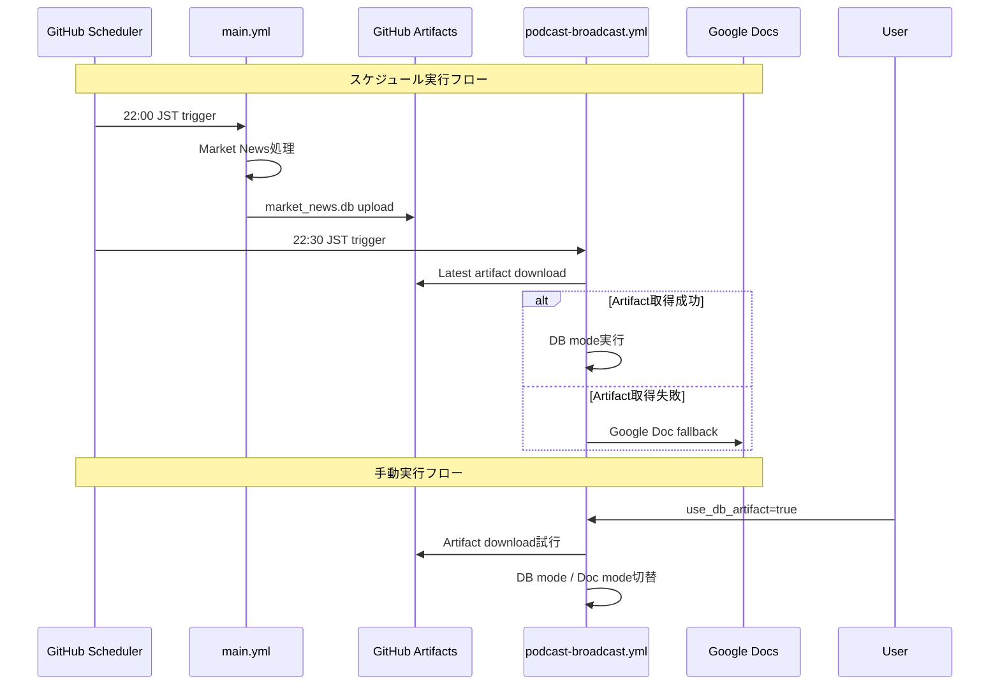

# ワークフロー間データ連携設計書：方式A（アーティファクト連携・スケジュール同期）

**作成日時:** 2025年08月21日  
**対象ブランチ:** `feature/google-cloud-tts-test`  
**設計方式:** 方式A - アーティファクト連携（スケジュール同期）

---

## 1. 設計概要

### 1.1 目的
`main.yml`（Market News Scraper）で生成されるデータベース成果物（`market_news.db`）を、スケジュール駆動でポッドキャスト配信（`podcast-broadcast.yml`）へ効率的に引き継ぐ仕組みを実現する。

### 1.2 基本方針
- **スケジュール連携**: 定期実行時のみ連結（例: main 22:00 JST → podcast 22:30 JST）
- **独立実行**: 自動実行時はworkflow_runトリガーを使用しない（API呼び出し回避）
- **手動選択**: 手動実行時は連結使用の可否を選択可能（`use_db_artifact: true/false`）
- **フォールバック**: アーティファクト未取得時はGoogleドキュメント（AI要約Doc）を使用
- **コスト最適化**: 余分なAPI呼び出し・二重起動を避け、アーティファクトDLのみ追加

---

## 2. 要件定義

### 2.1 機能要件
1. **main.yml成果物管理**
   - 成功時に`market_news.db`をアーティファクト`market-news-db`としてアップロード
   - 保持期間: 2日間（コスト抑制と掃除）

2. **podcast-broadcast.yml連携**
   - トリガー: `schedule`と`workflow_dispatch`のみ
   - 入力パラメータ: `use_db_artifact`（choice: true/false, default=false）
   - データソース自動判定: アーティファクト取得成功/失敗に応じて自動切替

3. **処理フロー**
   - スケジュール起動時 → 最新成功main実行のアーティファクト取得を試行
   - 手動起動時 → `use_db_artifact`がtrueのときのみアーティファクト取得
   - 取得成功 → `PODCAST_DATA_SOURCE=database`で実行
   - 取得失敗 → `PODCAST_DATA_SOURCE=google_document`で実行

### 2.2 非機能要件
- **可用性**: アーティファクト取得失敗時のフォールバック保証
- **運用性**: ログ・サマリでデータソースとアーティファクト情報を明記
- **セキュリティ**: アーティファクトには機密情報を含めない（SQLiteのみ）
- **コスト**: 短期retention（1-2日）でストレージコストを抑制

---

## 3. システム構成

### 3.1 アーキテクチャ概要



### 3.2 データフロー
1. **main.yml** → **GitHub Artifacts**: `market_news.db`（retention: 2日）
2. **GitHub Artifacts** → **podcast-broadcast.yml**: アーティファクトダウンロード
3. **フォールバック**: Google Document API → AI要約Doc取得

---

## 4. 技術仕様

### 4.1 main.yml変更点

#### 4.1.1 アーティファクトアップロード追加
```yaml
# main.ymlの最終ステップに追加
- name: Upload database artifact
  if: success()
  uses: actions/upload-artifact@v4
  with:
    name: market-news-db
    path: market_news.db
    retention-days: 2
    compression-level: 6
```

#### 4.1.2 成功条件
- 既存のMarket News処理が正常完了した場合のみアップロード
- ファイル存在チェック（`market_news.db`が生成されている）

### 4.2 podcast-broadcast.yml変更点

#### 4.2.1 入力パラメータ追加
```yaml
on:
  schedule:
    - cron: '30 13 * * *'  # 22:30 JST
  workflow_dispatch:
    inputs:
      use_db_artifact:
        description: 'Use database artifact from main workflow'
        required: false
        default: 'false'
        type: choice
        options:
          - 'true'
          - 'false'
```

#### 4.2.2 アーティファクトダウンロードステップ
```yaml
- name: Download database artifact
  id: download-artifact
  if: |
    github.event_name == 'schedule' || 
    (github.event_name == 'workflow_dispatch' && github.event.inputs.use_db_artifact == 'true')
  uses: dawidd6/action-download-artifact@v2
  continue-on-error: true
  with:
    workflow: main.yml
    name: market-news-db
    path: .
    search_artifacts: true
    
- name: Check artifact download result
  id: artifact-status
  run: |
    if [ -f "market_news.db" ]; then
      echo "artifact_available=true" >> $GITHUB_OUTPUT
      echo "data_source=database" >> $GITHUB_OUTPUT
      ls -la market_news.db
    else
      echo "artifact_available=false" >> $GITHUB_OUTPUT
      echo "data_source=google_document" >> $GITHUB_OUTPUT
    fi
```

#### 4.2.3 環境変数設定
```yaml
- name: Set podcast environment variables
  run: |
    echo "PODCAST_DATA_SOURCE=${{ steps.artifact-status.outputs.data_source }}" >> $GITHUB_ENV
    if [ "${{ steps.artifact-status.outputs.data_source }}" = "google_document" ]; then
      echo "GOOGLE_DOCUMENT_ID=${{ secrets.GOOGLE_DAILY_SUMMARY_DOC_ID }}" >> $GITHUB_ENV
    fi
```

### 4.3 データソース判定ロジック

#### 4.3.1 判定条件
| 実行タイプ | use_db_artifact | アーティファクト状態 | データソース |
|-----------|-----------------|-------------------|-------------|
| schedule | - | 取得成功 | database |
| schedule | - | 取得失敗 | google_document |
| manual | true | 取得成功 | database |
| manual | true | 取得失敗 | google_document |
| manual | false | - | google_document |

#### 4.3.2 実装コード
```yaml
- name: Determine data source
  id: data-source
  run: |
    if [[ "${{ github.event_name }}" == "schedule" ]]; then
      # スケジュール実行時は常にアーティファクト取得を試行
      USE_ARTIFACT="true"
    elif [[ "${{ github.event_name }}" == "workflow_dispatch" ]]; then
      # 手動実行時はinputに従う
      USE_ARTIFACT="${{ github.event.inputs.use_db_artifact }}"
    else
      USE_ARTIFACT="false"
    fi
    
    echo "use_artifact=$USE_ARTIFACT" >> $GITHUB_OUTPUT
    echo "trigger_type=${{ github.event_name }}" >> $GITHUB_OUTPUT
```

---

## 5. エラーハンドリング・フォールバック

### 5.1 エラーシナリオ
1. **アーティファクト未発見**: 対象期間内にmain.ymlの成功実行がない
2. **ダウンロード失敗**: GitHub API制限、ネットワーク問題
3. **ファイル破損**: ダウンロードされたDBファイルが破損
4. **Google Doc未設定**: フォールバック時にGOOGLE_DOCUMENT_IDが未設定

### 5.2 フォールバック処理
```yaml
- name: Validate database file
  id: validate-db
  if: steps.artifact-status.outputs.artifact_available == 'true'
  run: |
    if sqlite3 market_news.db ".tables" > /dev/null 2>&1; then
      echo "db_valid=true" >> $GITHUB_OUTPUT
    else
      echo "db_valid=false" >> $GITHUB_OUTPUT
      echo "Database file is corrupted, falling back to Google Document"
      rm -f market_news.db
    fi

- name: Final data source decision
  id: final-source
  run: |
    if [[ -f "market_news.db" && "${{ steps.validate-db.outputs.db_valid }}" == "true" ]]; then
      echo "PODCAST_DATA_SOURCE=database" >> $GITHUB_ENV
      echo "final_source=database" >> $GITHUB_OUTPUT
    else
      echo "PODCAST_DATA_SOURCE=google_document" >> $GITHUB_ENV
      echo "GOOGLE_DOCUMENT_ID=${{ secrets.GOOGLE_DAILY_SUMMARY_DOC_ID }}" >> $GITHUB_ENV
      echo "final_source=google_document" >> $GITHUB_OUTPUT
    fi
```

### 5.3 エラーログ・通知
```yaml
- name: Log data source decision
  run: |
    echo "=== Podcast Data Source Decision ==="
    echo "Trigger: ${{ github.event_name }}"
    echo "Use artifact requested: ${{ steps.data-source.outputs.use_artifact }}"
    echo "Artifact available: ${{ steps.artifact-status.outputs.artifact_available }}"
    echo "Database valid: ${{ steps.validate-db.outputs.db_valid }}"
    echo "Final data source: ${{ steps.final-source.outputs.final_source }}"
    echo "================================="
```

---

## 6. ログ・サマリ機能

### 6.1 アーティファクト情報記録
```yaml
- name: Record artifact information
  if: steps.artifact-status.outputs.artifact_available == 'true'
  run: |
    # アーティファクト情報をログに記録
    echo "=== Artifact Information ==="
    echo "Artifact name: market-news-db"
    echo "Source workflow: main.yml"
    echo "Download time: $(date -u +"%Y-%m-%dT%H:%M:%SZ")"
    echo "File size: $(stat -f%z market_news.db 2>/dev/null || stat -c%s market_news.db)"
    echo "File modified: $(stat -f%m market_news.db 2>/dev/null || stat -c%Y market_news.db)"
    echo "=========================="
```

### 6.2 サマリ出力
```yaml
- name: Generate execution summary
  if: always()
  run: |
    cat << 'EOF' >> $GITHUB_STEP_SUMMARY
    ## Podcast Broadcast Execution Summary
    
    ### Data Source Configuration
    - **Trigger**: ${{ github.event_name }}
    - **Use DB Artifact**: ${{ steps.data-source.outputs.use_artifact }}
    - **Final Data Source**: ${{ steps.final-source.outputs.final_source }}
    
    ### Artifact Status
    - **Artifact Available**: ${{ steps.artifact-status.outputs.artifact_available }}
    - **Database Valid**: ${{ steps.validate-db.outputs.db_valid }}
    
    ### Execution Details
    - **Execution Time**: $(date -u +"%Y-%m-%d %H:%M:%S UTC")
    - **Runner**: ${{ runner.os }}
    EOF
```

---

## 7. セキュリティ・運用考慮事項

### 7.1 セキュリティ
- **アーティファクト内容**: SQLiteファイルのみ（API Key等の機密情報は含まない）
- **アクセス制御**: 同一リポジトリ内でのアーティファクト共有のみ
- **保持期間**: 短期（2日）で自動削除

### 7.2 運用・監視
- **ログレベル**: INFO/ERRORによる実行状況の明確化
- **メトリクス**: アーティファクト取得成功率、フォールバック発生率
- **アラート**: 連続フォールバック発生時の通知（将来実装）

### 7.3 コスト管理
- **ストレージ**: アーティファクトの短期保持（2日）
- **転送**: ダウンロードのみ（アップロードはmain.ymlで1回）
- **API**: dawidd6/actionの効率的なアーティファクト検索

---

## 8. 実装タスク詳細

### 8.1 Phase 1: main.yml修正
- [ ] アーティファクトアップロードステップ追加
- [ ] 成功条件の設定（`if: success()`）
- [ ] ファイル存在確認の実装

### 8.2 Phase 2: podcast-broadcast.yml修正
- [ ] 入力パラメータ`use_db_artifact`の追加
- [ ] アーティファクトダウンロードステップの実装
- [ ] データソース判定ロジックの実装
- [ ] 環境変数設定の自動化

### 8.3 Phase 3: エラーハンドリング
- [ ] アーティファクト検証機能
- [ ] フォールバック処理の実装
- [ ] エラーログの詳細化

### 8.4 Phase 4: 監視・ログ
- [ ] アーティファクト情報記録機能
- [ ] 実行サマリ生成機能
- [ ] GitHub Step Summaryとの連携

---

## 9. テスト計画

### 9.1 単体テスト
- [ ] アーティファクトアップロード成功/失敗
- [ ] アーティファクトダウンロード成功/失敗
- [ ] データソース判定ロジック各パターン

### 9.2 統合テスト
- [ ] スケジュール実行時の正常フロー
- [ ] 手動実行（use_db_artifact=true）の正常フロー
- [ ] 手動実行（use_db_artifact=false）のフォールバック
- [ ] アーティファクト未存在時のフォールバック

### 9.3 運用テスト
- [ ] 連続実行での動作確認
- [ ] ログ出力の妥当性確認
- [ ] コスト影響の測定

---

## 10. 今後の拡張可能性

### 10.1 方式B（Supabase）への移行準備
- 現在の設計はSupabase移行時にも活用可能
- `PODCAST_DATA_SOURCE`の環境変数設計は共通

### 10.2 監視・アラート強化
- アーティファクト取得失敗の継続監視
- データソース別パフォーマンス分析
- 自動復旧機能の追加

### 10.3 コスト最適化
- アーティファクト圧縮率の改善
- 不要なアーティファクトの自動削除
- 転送量の最小化

---

**設計完了日時:** 2025年08月21日  
**レビュー予定:** 実装前  
**実装予定開始:** 2025年08月21日

---