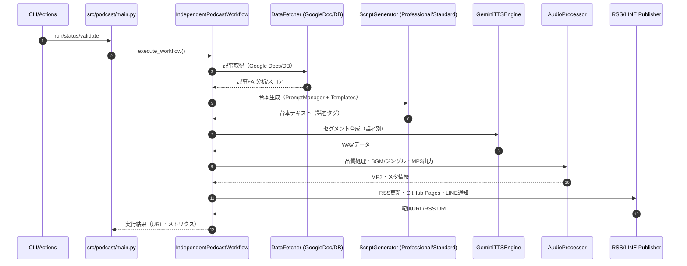
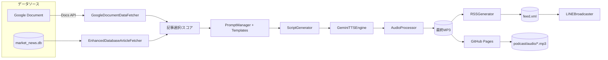
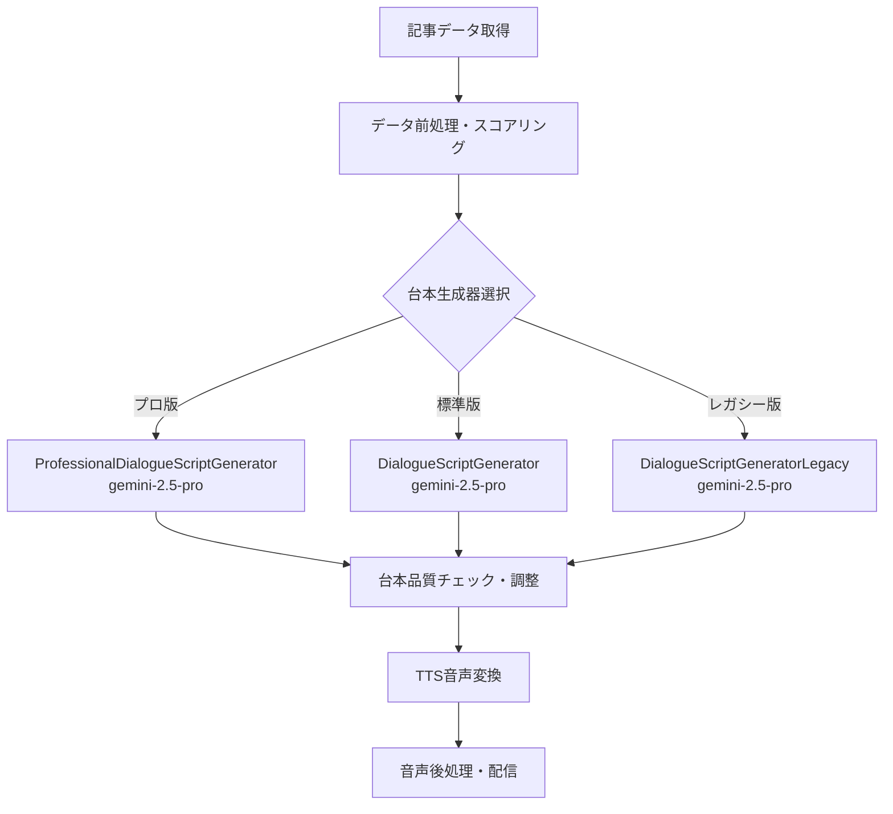

# Podcast音声生成ワークフロー整理

- 対象リポジトリ: `Market_News`
- 対象モジュール: `src/podcast/` 配下（data_fetcher / script_generation / prompts / tts / audio / publisher / workflow）
- 実行エントリ: `python -m src.podcast.main run`

## データ取得元（どこからデータを取るか）
- Googleドキュメント: `GoogleDocumentDataFetcher`
  - ファイル: `src/podcast/data_fetcher/google_document_data_fetcher.py`
  - `GOOGLE_DOCUMENT_ID` を用いて Docs API から本文を取得・解析
  - AI要約（統合市場概況）も Googleドキュメントから抽出可能
- データベース: `EnhancedDatabaseArticleFetcher`
  - ファイル: `src/podcast/data_fetcher/enhanced_database_article_fetcher.py`
  - `Article` と `AIAnalysis` を `JOIN` し、過去 `hours_back` 時間の分析済み記事を取得（標準24h）

## 取得データの詳細
- 共通（記事スコアリング用の基本要素）
  - タイトル: 記事見出し
  - URL: 記事リンク
  - 本文/要約: 本文やサマリー（要約はAIまたは本文冒頭から生成）
  - カテゴリ/地域: キーワード推定（例: 金融政策/経済指標/企業業績、japan/usa/china/europe/other）
  - メタ情報: `source`（Reuters/Bloomberg等）, `published_at`/`scraped_at`

- Googleドキュメント由来（`GoogleDocumentDataFetcher`）
  - 解析済み構造: `ParsedArticle(title, url, published_time, body)`
  - 本文サニタイズ: Markdown/HTML除去、不要記号削除、空白正規化
  - 要約: 本文先頭200文字を切り出し（200超で `...` 付与）
  - スコア: `min(len(body)/1000,1)*2` を基礎に降順ソート

- データベース由来（`EnhancedDatabaseArticleFetcher`）
  - 取得対象: `Article`×`AIAnalysis` で最新100件程度を候補に抽出
  - スコア内訳（例）: 要約長・カテゴリ/地域重み・新着度（時間経過ペナルティ）を加重
  - 多様性制約: 地域/カテゴリカバレッジ、ソース分散、時間帯分散、タイトル重複抑止

## データの抽出条件（主なロジック）
- Googleドキュメント解析
  - 記事区切り: 10本以上の `-` で分割
  - タイトル行: `"(YYYY-MM-DD HH:MM) [絵文字]? タイトル"` に一致
  - 次行がURL、その後ろを本文とみなす
  - 本文開始の検出: `--- 記事全文 --- / 記事全文 / 全文 / 本文 / ---` のいずれか、または3行目以降
  - しきい値: 本文が短すぎる場合は代替抽出を実施し、最終的に50文字未満なら除外
  - 最終採用数: `target_count`（標準6件）で打ち切り

- データベース選定
  - 範囲: `hours_back` 時間（標準24h）以内の `Article.scraped_at`
  - スコアリング: 要約長/カテゴリ/地域/新着度の重み付き合算
  - カバレッジ制約: 最低3地域・3カテゴリのカバー、同カテゴリ・同地域の偏り緩和、ソース/時間帯の分散
  - 重複抑止: タイトルの単語集合類似度が70%超を重複として除外

## 台本生成（どのようなプロンプトか）
- プロフェッショナル版（推奨）: `ProfessionalDialogueScriptGenerator`
  - ファイル: `src/podcast/script_generation/professional_dialogue_script_generator.py`
  - **使用Geminiモデル**: `gemini-2.5-pro`（デフォルト）
  - 管理: `PromptManager`（`src/podcast/prompts/prompt_manager.py`）とテンプレート
  - 代表テンプレート: `src/podcast/prompts/templates/current_professional.txt`
  - 特徴
    - 目標時間/文字数: 10分想定で約`target_chars`（テンプレート内で可変）
    - 構成: オープニング（~200字）→メイン（指標・重要記事3本×各~400字・関連性分析・展望）→クロージング（~200字）
    - 表現: 話し言葉、専門用語の補助説明、数値読み上げ最適化、1文30字以内推奨
    - 統合文脈: DB/GoogleドキュメントのAI要約を統合（市場概況の上位文脈）
    - 生成設定: `PromptManager.get_generation_config()` から `temperature / max_output_tokens` を取得

- 標準版: `DialogueScriptGenerator`
  - ファイル: `src/podcast/script_generation/dialogue_script_generator.py`
  - **使用Geminiモデル**: `gemini-2.5-pro`（デフォルト）
  - 内蔵プロンプトで 15分程度（4000–4500字目安）の多層構造（Tier1/2/3）
  - 記事データは Tier1(上位3), Tier2(次5), Tier3(次7) に振り分けて網羅的に解説

- レガシー版: `DialogueScriptGeneratorLegacy`
  - ファイル: `src/podcast/script_generator.py`  
  - **使用Geminiモデル**: `gemini-2.5-pro`（統一）
  - 簡易的な内蔵プロンプトによる台本生成

## 台本生成時の制約
- 文字数レンジ
  - プロフェッショナル版: テンプレートで `target_chars_min/max` による厳密チェック（例: ±100字幅）
  - 標準版: 4000–4500字を目標に超過時は段落単位でトリム
- 構造必須
  - オープニング/メイン/クロージングの完結構造
  - 終了文言: 「以上、本日の市場ニュースポッドキャストでした。明日もよろしくお願いします。」（プロ版テンプレートで強制）
- 読みやすさ
  - 話し言葉、1文30文字以内目安、句読点・改行で読み上げ最適化
  - 発音辞書適用（`config/pronunciation_dict.yaml`）で固有名詞を音声向けに置換
- 品質調整
  - プロ版は自動品質評価（文字数/推定時間/構造/可読性/専門性）と再調整プロンプト
- パターン切替
  - 環境変数 `PODCAST_PROMPT_PATTERN` でテンプレート切替（デフォルトは `current_professional`）

## 音声変換（台本→音声）
- TTSエンジン: `GeminiTTSEngine`
  - ファイル: `src/podcast/tts/gemini_tts_engine.py`
  - 話者分離: 台本テキストを適切な長さのセグメントに分割し順次合成
  - 音声合成: Google Cloud Text-to-Speech API使用による高品質音声生成
  - 音声品質: 44.1kHz、MP3形式、日本語Neural2-D音声
  - コスト管理: Google Cloud TTS APIの利用制限に基づく管理

## 音声変換時の制約
- コスト制限: 月次累計を文字数ベースで概算計測し、超過時は停止
- セグメント結合: 話者交代時 500ms 無音、同話者継続 200ms 無音で自然な切替
- 出力形式: 一旦 WAV を内部使用後、後段の処理で MP3 化

## 音声後処理（品質・サイズ最適化）
- プロセッサ: `AudioProcessor`
  - ファイル: `src/podcast/audio_processor.py`
  - 基本調整: サンプルレート `44.1kHz`、ステレオ化、簡易ノイズ除去（HPF 80Hz）とダイナミックレンジ圧縮
  - BGM/ジングル: `src/podcast/assets/` の `intro_jingle.mp3` / `outro_jingle.mp3` / `background_music.mp3` / `segment_transition.mp3` をオーバーレイ
  - 音量規格: 目標 `-16.0 LUFS`、ピーク `-1.0 dBFS`（`pyloudnorm` があれば厳密、無ければ近似）
  - 時間調整: 目標10.0分、最大10.5分（超過時はフェードアウト短縮）
  - 出力: `mp3`, 既定 `128k`。上限（標準15MB）超過時は段階的に `96k/80k/64k` へダウンサイジング
  - レベル測定: LUFS/Peak 測定（`pyloudnorm` 利用時）
  - クレジット: CC-BY 素材のクレジット文字列を生成（RSS/LINE文面にも流用可能）

## 配信（参考）
- RSS生成: `RSSGenerator`（`feedgen` 使用）で `podcast/episodes.json` を基に `podcast/feed.xml` を出力
- GitHub Pages: ローカルリポジトリ配下 `podcast/audio/` に音声を配置し、`git add/commit/push` で公開
- LINE配信: `LINEBroadcaster` がブロードキャスト（最大文字数制限やリトライ制御あり）

## 配信テーマ（番組コンセプト）
- 目的: 金融・経済の「1日の振り返り」を、投資家/経営者に向けてコンパクトに提供
- 内容
  - 主要指数・為替・債券の本日実績と要因
  - 重要ニュースの深掘り解説（3本を中心に）と相互関連の整理
  - リスク要因と短期展望（翌日〜1週間の注目材料）
  - クロージングでキーポイント総括と「明日もよろしくお願いします」で締め
- 想定尺
  - 10分完全版（プロフェッショナル版テンプレート）
  - 15分拡張版（標準ジェネレータの多層構造プロンプト）

## 主要な環境変数（抜粋）
- Google/Docs: `GOOGLE_OAUTH2_CLIENT_ID`, `GOOGLE_OAUTH2_CLIENT_SECRET`, `GOOGLE_OAUTH2_REFRESH_TOKEN`, `GOOGLE_DOCUMENT_ID`
- Gemini: `GEMINI_API_KEY`
- プロンプト切替: `PODCAST_PROMPT_PATTERN`（例: `current_professional`）
- 配信URLベース: `PODCAST_RSS_BASE_URL`

## 環境変数一覧（Podcast関連）

- 必須（基本稼働）
  - `GEMINI_API_KEY`: Gemini APIキー
  - `GOOGLE_OAUTH2_CLIENT_ID` / `GOOGLE_OAUTH2_CLIENT_SECRET` / `GOOGLE_OAUTH2_REFRESH_TOKEN`: Google OAuth2 認証
  - `GOOGLE_DOCUMENT_ID`: 記事が格納されたGoogleドキュメントID

- 推奨/構成（Podcast設定）
  - `PODCAST_RSS_BASE_URL`: GitHub Pages等でのベースURL
  - `PODCAST_AUTHOR_NAME`, `PODCAST_AUTHOR_EMAIL`: 著者情報
  - `PODCAST_RSS_TITLE`, `PODCAST_RSS_DESCRIPTION`: フィード表示名/説明
  - `PODCAST_MONTHLY_COST_LIMIT`: 月次コスト上限（USD）
  - `PODCAST_TARGET_DURATION_MINUTES`: 目標尺（分）
  - `PODCAST_MAX_FILE_SIZE_MB`: MP3最大サイズ

- プロンプト/挙動切替
  - `PODCAST_PROMPT_PATTERN`: 使用テンプレート（既定: `current_professional`）
  - `PODCAST_DATA_SOURCE`: `database` | `google_document`（統合要約の取得元切替）
  - `PODCAST_SCRIPT_ONLY_MODE`: `true` 時は台本長調整をスキップ

- Googleドキュメント（統合要約）
  - `GOOGLE_DAILY_SUMMARY_DOC_ID`, `GOOGLE_AI_SUMMARY_DOC_ID`: 当日のAI要約ドキュメントID（任意）

- LINE配信（任意）
  - `LINE_CHANNEL_ACCESS_TOKEN`, `LINE_CHANNEL_SECRET`, `LINE_WEBHOOK_URL`

- データベース（任意・DB由来コンテキスト利用時）
  - `DATABASE_URL`（例: `sqlite:///market_news.db`）
  - `DATABASE_ECHO`（`true`/`false`）

- Google/共通（任意）
  - `GOOGLE_AUTH_METHOD`（`oauth2` 既定）
  - `GOOGLE_DRIVE_OUTPUT_FOLDER_ID`, `GOOGLE_OVERWRITE_DOC_ID`, `GOOGLE_SERVICE_ACCOUNT_JSON`

- ロギング/その他（任意）
  - `LOGGING_LEVEL`（例: `INFO`/`DEBUG`）
  - `GITHUB_OUTPUT`（GitHub Actions出力用・自動設定）

※ 旧構成/READMEでの `GITHUB_REPOSITORY_URL` はレガシー設定として扱い、現行 `publisher` 実装ではコード側設定を推奨。

## 実行例
- 通常実行: `python -m src.podcast.main run`
- 台本確認: `python -m src.podcast.main run --script-only`
- デバッグ: `python -m src.podcast.main run --debug`

## 図版（Mermaid）

### シーケンス図（全体フロー）

### データフロー図（コンポーネント間）

## エラーハンドリング（要点）
- データ取得: DBで分析記事が不足時は詳細ログ出力し空配列返却。Docs解析は本文短小・形式不一致時に除外/代替抽出。
- 台本生成: プロ版は完全性検証（終端文言/文字数）と再調整。標準版は長文時に段落トリム。`--script-only` で安全検証可能。
- TTS: 月間コスト上限に達すると停止。話者タグ未検出時は基本的なセグメント化を適用。
- 音声処理: LUFS測定不可時は簡易正規化。サイズ超過時はビットレート段階ダウン。
- 配信: RSS/Git操作は失敗時に例外化。LINEはレート制限(429)リトライ・長文検証あり。

## プロンプトテンプレート比較（概要）

- `current_professional.txt`
  - 特徴: プロ番組仕様、厳密な構成/終端文言、10分/文字数レンジの明示、統合文脈を前提に高品質化
  - 用途: 既定の本番用。投資家・経営者向けの落ち着いた専門トーン

- `constraint_optimization.txt`
  - 特徴: 文字数/構成/文長（1文30字）を厳格制約。チェックリスト付き
  - 用途: 厳密な制約順守が必要な検証・安定運用時

- `context_aware.txt`
  - 特徴: 記事間の関連性と市場全体の「物語」重視。因果/時系列/波及にフォーカス
  - 用途: 連関の強いニュース群をまとめる日の編集向け

- `cot_enhanced.txt`
  - 特徴: 思考過程（分析→構成→執筆）を明示するCoTスタイル。10分/±50字制約
  - 用途: 一貫性・論理性を最優先する回

- `enhanced_persona.txt`
  - 特徴: 指定ペルソナ（田中健一）での語り口を固定。番組回次・決まり文句を含む
  - 用途: キャラクター性を前面に出したブランディング回

- `few_shot_learning.txt`
  - 特徴: 良質サンプルに倣うFew-shot誘導。具体例ベースで品質を固定
  - 用途: 品質基準を素早く満たしたい試行/量産時

- `minimalist.txt`
  - 特徴: 最小限の要件のみ。10分/±50字、簡素な構成指示
  - 用途: 迅速生成・ドラフト用途。後段でポストプロセス前提

## Geminiモデルの役割とワークフロー内での使用箇所

### 台本生成での使用
ワークフローにおけるGeminiモデルは、**台本生成段階**でのみ使用され、記事データを自然な対話形式のポッドキャスト台本に変換する重要な役割を担っています。

#### 使用モデルとその特徴
1. **gemini-2.5-pro**（プロフェッショナル版の既定モデル）
   - **使用箇所**: `ProfessionalDialogueScriptGenerator`
   - **目的**: 高品質な台本生成、複雑な市場分析の構造化
   - **特徴**: 長文生成能力が高く、専門的な金融用語の適切な使用が可能

2. **gemini-2.5-pro**（標準版の既定モデル）
   - **使用箇所**: `DialogueScriptGenerator`  
   - **目的**: 高品質な台本生成、多層構造の対話生成
   - **特徴**: 統一されたモデルによる安定した品質

3. **gemini-2.5-pro**（レガシー版の統一モデル）
   - **使用箇所**: `DialogueScriptGeneratorLegacy`
   - **目的**: 統一された高品質な台本生成
   - **特徴**: 全ジェネレータで統一されたモデル使用

#### ワークフロー内での処理フロー

#### Gemini API呼び出しの詳細
- **API設定**: `genai.configure(api_key=api_key)` で初期化
- **モデル初期化**: `genai.GenerativeModel(model_name)` でインスタンス生成
- **生成処理**: `model.generate_content(prompt)` でプロンプトから台本生成
- **生成設定**: `PromptManager.get_generation_config()` から `temperature`・`max_output_tokens` を取得（プロ版のみ）

### 他の処理段階での非使用
- **データ取得**: GoogleドキュメントAPI・データベースクエリのみ使用
- **音声変換**: Google Cloud Text-to-Speech APIを使用（Geminiは不使用）
- **音声後処理**: PyDubなどのオーディオライブラリを使用
- **配信処理**: RSS生成・GitHub API・LINE APIを使用

Geminiモデルは台本生成という「創作的な言語処理タスク」に特化して使用されており、ワークフロー全体の中核的な知的処理を担当しています。

---

最終的に、Googleドキュメント/DBの両データソースから厳選した記事と当日の統合市場概況を文脈として、厳密な構成・文字数制約を持つプロンプトで台本を生成し、話者セグメントに基づいたTTS→音声後処理→RSS/LINE配信までを自動化します。番組テーマは「当日の市場振り返り」を中核に、実務的で聞きやすい10分（または15分）番組を安定配信することです。
