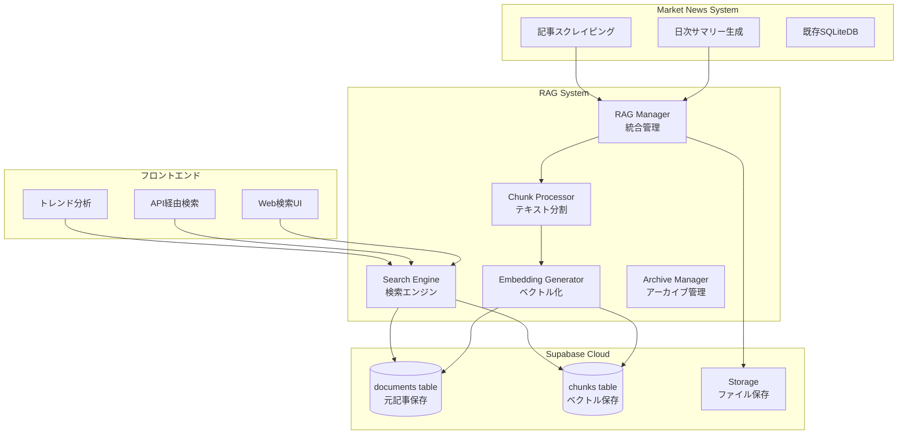
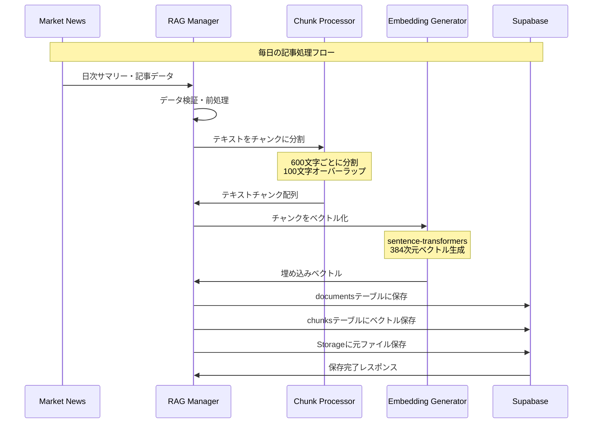
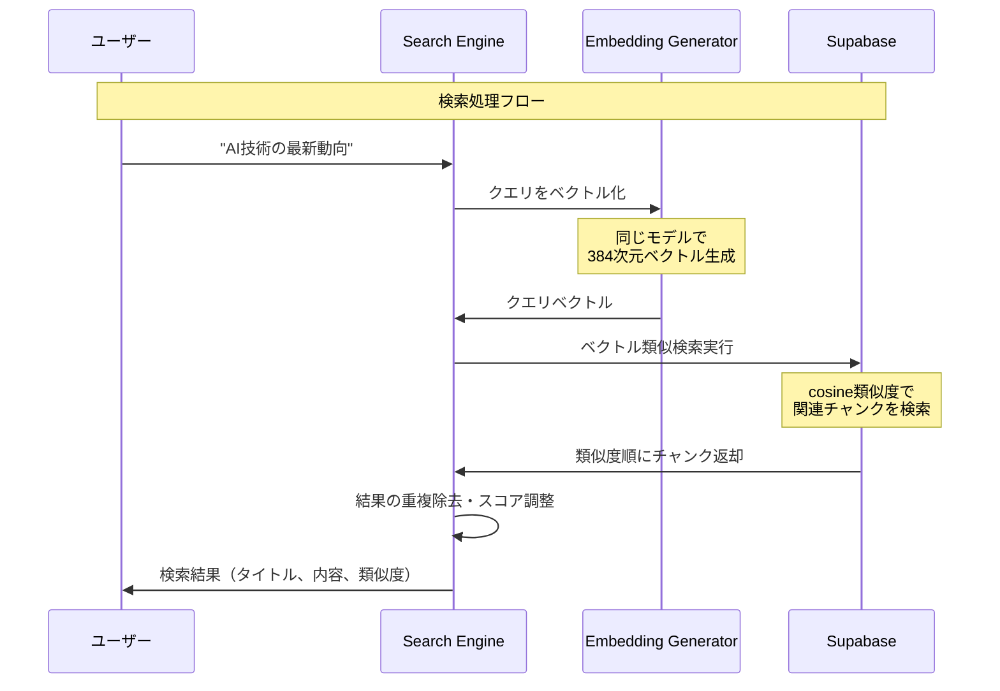

# RAGシステム完全ガイド

Market News RAG（Retrieval-Augmented Generation）システムの仕組みとデータフローを図解でわかりやすく説明します。

## 🤔 RAGシステムって何？

**RAG = Retrieval（検索） + Augmented（拡張） + Generation（生成）**

簡単に言うと：**AIが理解できる形で過去のデータを保存し、人間の質問に対して関連する情報を素早く見つけてくれるシステム**です。

### 従来の検索 vs RAG検索

| 検索方法 | 検索クエリ | 見つかる記事 |
|---------|-----------|-------------|
| **従来検索** | "日銀" | "日銀"が含まれる記事のみ |
| **RAG検索** | "日銀" | "日銀", "中央銀行", "金融政策", "利上げ"などを含む記事すべて |

RAGは**意味を理解**して検索するので、より関連性の高い結果が得られます。

## 🔄 全体システム構成



## 📊 データフローの詳細

### 1. データ入力フロー（アーカイブ処理）



### 2. 検索フロー（クエリ処理）



## 🗄️ Supabaseデータベース構造

### documentsテーブル（元記事保存）
```sql
documents {
  id: UUID (主キー)
  title: TEXT (記事タイトル)
  content: TEXT (元の記事内容全文)
  doc_type: TEXT ('summary' | 'article')
  metadata: JSONB {
    category: 'technology',
    date: '2024-08-24', 
    source: 'reuters'
  }
  created_at: TIMESTAMP
  updated_at: TIMESTAMP
}
```

### chunksテーブル（検索用ベクトル）
```sql
chunks {
  id: UUID (主キー)
  document_id: UUID (documentsテーブルへの外部キー)
  content: TEXT (チャンクの内容: 約600文字)
  embedding: VECTOR(384) (384次元のベクトル)
  chunk_index: INTEGER (文書内での順番: 0, 1, 2...)
  metadata: JSONB {
    category: 'technology',
    source: 'reuters',
    word_count: 580
  }
  created_at: TIMESTAMP
}
```

### Storageバケット（ファイル保存）
```
market-news-archive/
├── 2024/
│   ├── 08/
│   │   ├── 24/
│   │   │   ├── daily_summary.json
│   │   │   ├── daily_summary.md
│   │   │   └── articles_batch_001.json
│   │   └── 25/
│   │       └── ...
│   └── 09/
│       └── ...
```

## 🔍 実際の使用例

### パターン1: 日常の記事アーカイブ
```python
# 毎日夜に自動実行（cron job）
def daily_archive():
    # 今日生成された記事を取得
    summary = get_daily_summary()
    articles = get_today_articles()
    
    # RAGシステムにアーカイブ
    rag_manager.archive_daily_summary(summary)
    rag_manager.archive_articles(articles)
    
    print(f"✅ {len(articles)}件の記事をアーカイブしました")
```

### パターン2: Web APIでの検索
```python
# Flask/FastAPI エンドポイント
@app.route('/api/search')
def search_news():
    query = request.args.get('q')  # "金融政策の影響"
    
    # RAGシステムで意味検索
    results = rag_manager.search_content(query, limit=10)
    
    return jsonify([{
        'title': result.title,
        'snippet': result.content[:200] + '...',
        'similarity': f"{result.similarity:.3f}",
        'date': result.metadata.get('date'),
        'category': result.metadata.get('category')
    } for result in results])
```

### パターン3: トレンド分析
```python
# 過去30日のトレンドキーワード分析
trends = rag_manager.get_trending_topics(
    start_date=datetime.now() - timedelta(days=30),
    limit=10
)

# 結果例:
# [
#   {'topic': 'AI技術', 'frequency': 45, 'score': 0.89},
#   {'topic': '金利政策', 'frequency': 38, 'score': 0.82},
#   {'topic': '株価動向', 'frequency': 32, 'score': 0.78}
# ]
```

## 💡 RAGシステムの強み

### 🚀 速度
- 0.1秒で数万件から関連記事を発見
- インデックス検索により高速レスポンス

### 🧠 意味理解
| 検索語 | 見つかる関連語 |
|--------|---------------|
| "AI" | "人工知能", "機械学習", "深層学習", "ChatGPT" |
| "株価" | "市場動向", "投資", "証券", "日経平均" |
| "金利" | "中央銀行", "日銀", "FRB", "金融政策" |

### 💰 コスト効率
- Supabase Free tier: 月500MB、50万リクエスト無料
- 追加費用なしで高度な検索機能

### 📈 スケーラビリティ
- 年間数万件の記事を処理可能
- 必要に応じてPro tierに簡単移行

## 🔧 システム管理

### 日常メンテナンス
```python
# システム状態確認
status = rag_manager.get_system_status()
print(f"ドキュメント数: {status['total_documents']}")
print(f"チャンク数: {status['total_chunks']}")
print(f"ストレージ使用量: {status['storage_usage']} MB")
```

### パフォーマンス最適化
- **チャンクサイズ調整**: 600文字 → 用途に応じて400-800文字
- **ベクトル次元**: 384次元 → 精度重視なら768次元
- **インデックス再構築**: 月1回程度

## 📋 次のステップ

1. **[クイックスタートガイド](./04_QUICK_START_GUIDE.md)** でセットアップ
2. **[使用例集](./06_USE_CASES.md)** で活用方法を学ぶ  
3. **[運用手順書](./05_OPERATION_MANUAL.md)** で日常運用をマスター

---

> **💡 ポイント**: RAGシステムは「賢い図書館司書」のようなもの。大量の情報から、あなたの質問に最も関連する情報を素早く見つけて教えてくれます。