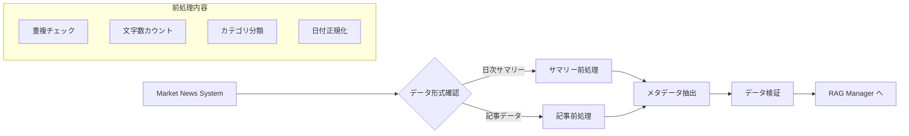
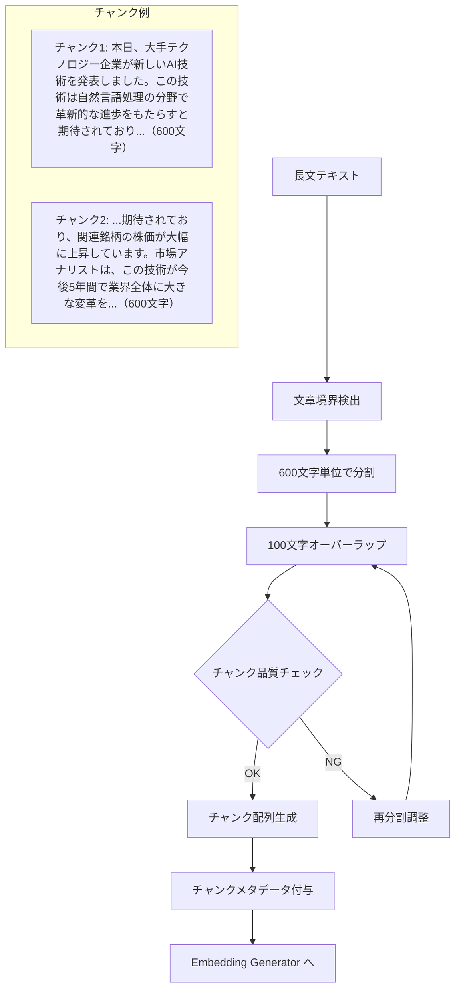
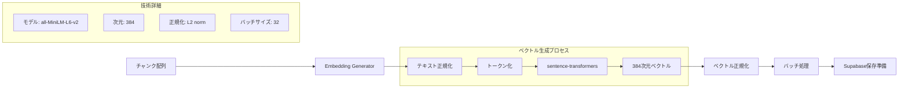
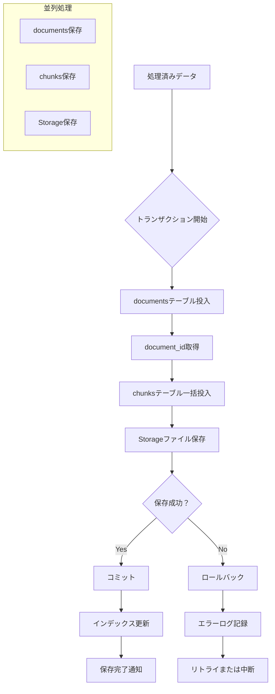
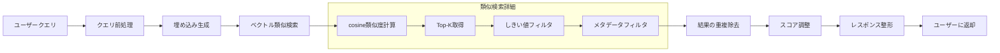

# データフロー詳細

RAGシステム内部でのデータの流れと処理プロセスを詳細に解説します。

## 📋 処理フェーズ別詳細

### フェーズ1: データ受け取り・前処理



#### 具体的なデータ変換例
```python
# 入力データ例
input_article = {
    "title": "AI技術の最新動向について",
    "content": "本日、大手テクノロジー企業が...",
    "published_at": "2024-08-24T10:30:00Z",
    "category": "tech"
}

# 前処理後
processed_data = {
    "id": "uuid-generated",
    "title": "AI技術の最新動向について",
    "content": "本日、大手テクノロジー企業が...",
    "doc_type": "article",
    "metadata": {
        "category": "technology",
        "source": "market_news",
        "published_date": "2024-08-24",
        "word_count": 1250,
        "language": "ja"
    },
    "created_at": "2024-08-24T10:30:00Z"
}
```

### フェーズ2: テキストチャンキング



#### チャンク分割の詳細ロジック
```python
def create_chunks(text, chunk_size=600, overlap=100):
    chunks = []
    start = 0
    
    while start < len(text):
        # チャンク終了位置を計算
        end = start + chunk_size
        
        # 文章境界で調整（句読点で切る）
        if end < len(text):
            # 最後の句点または改行を探す
            for i in range(end, start + chunk_size//2, -1):
                if text[i] in ['。', '！', '？', '\n']:
                    end = i + 1
                    break
        
        chunk = text[start:end]
        
        # チャンクメタデータ
        chunk_data = {
            "content": chunk,
            "chunk_index": len(chunks),
            "start_pos": start,
            "end_pos": end,
            "word_count": len(chunk)
        }
        
        chunks.append(chunk_data)
        
        # 次のチャンクの開始位置（オーバーラップあり）
        start = end - overlap
        
    return chunks
```

### フェーズ3: 埋め込みベクトル生成



#### 埋め込み生成の実装例
```python
def generate_embeddings(chunks):
    model = SentenceTransformer('all-MiniLM-L6-v2')
    
    # テキストのみ抽出
    texts = [chunk['content'] for chunk in chunks]
    
    # バッチ処理で高速化
    embeddings = model.encode(
        texts,
        batch_size=32,
        normalize_embeddings=True,  # L2正規化
        show_progress_bar=True
    )
    
    # チャンクデータに埋め込みを追加
    for chunk, embedding in zip(chunks, embeddings):
        chunk['embedding'] = embedding.tolist()
    
    return chunks
```

### フェーズ4: Supabaseデータベース保存



#### データベース保存の実装
```python
async def save_to_supabase(document_data, chunks_data):
    async with supabase_client.transaction():
        try:
            # 1. documentsテーブルに保存
            doc_result = await supabase_client.table('documents').insert({
                'title': document_data['title'],
                'content': document_data['content'],
                'doc_type': document_data['doc_type'],
                'metadata': document_data['metadata']
            }).execute()
            
            document_id = doc_result.data[0]['id']
            
            # 2. chunksテーブルに一括保存
            chunks_to_insert = []
            for chunk in chunks_data:
                chunks_to_insert.append({
                    'document_id': document_id,
                    'content': chunk['content'],
                    'embedding': chunk['embedding'],
                    'chunk_index': chunk['chunk_index'],
                    'metadata': chunk.get('metadata', {})
                })
            
            await supabase_client.table('chunks').insert(chunks_to_insert).execute()
            
            # 3. Storageにファイル保存（並列）
            await save_to_storage(document_data, document_id)
            
            return {'success': True, 'document_id': document_id}
            
        except Exception as e:
            # ロールバックは自動的に実行される
            return {'success': False, 'error': str(e)}
```

### フェーズ5: 検索処理



#### 検索SQLの詳細
```sql
-- ベクトル類似検索クエリ
SELECT 
    c.id as chunk_id,
    d.id as document_id,
    d.title,
    c.content,
    (c.embedding <=> $1::vector) as similarity,
    c.metadata,
    d.metadata as doc_metadata,
    d.created_at
FROM chunks c
JOIN documents d ON c.document_id = d.id
WHERE 
    -- 類似度しきい値フィルタ
    (c.embedding <=> $1::vector) < $2
    -- 日付フィルタ
    AND d.created_at >= $3
    -- カテゴリフィルタ（オプション）
    AND ($4::text IS NULL OR d.metadata->>'category' = $4)
ORDER BY 
    c.embedding <=> $1::vector
LIMIT $5;
```

## 🔍 パフォーマンス最適化

### インデックス戦略
```sql
-- ベクトル検索用インデックス（IVF-Flat）
CREATE INDEX idx_chunks_embedding_ivfflat 
ON chunks 
USING ivfflat (embedding vector_cosine_ops) 
WITH (lists = 100);

-- メタデータ検索用インデックス
CREATE INDEX idx_chunks_metadata_category 
ON chunks USING GIN ((metadata->>'category'));

-- 日付範囲検索用インデックス
CREATE INDEX idx_documents_created_at 
ON documents (created_at DESC);
```

### バッチ処理最適化
```python
class BatchProcessor:
    def __init__(self, batch_size=100):
        self.batch_size = batch_size
        
    async def process_documents(self, documents):
        batches = [
            documents[i:i+self.batch_size] 
            for i in range(0, len(documents), self.batch_size)
        ]
        
        tasks = []
        for batch in batches:
            task = asyncio.create_task(self.process_batch(batch))
            tasks.append(task)
        
        results = await asyncio.gather(*tasks)
        return sum(results, [])  # フラット化
```

## 📊 システム監視とメトリクス

### 監視対象メトリクス
```python
class SystemMetrics:
    def collect_metrics(self):
        return {
            "database_metrics": {
                "total_documents": self.count_documents(),
                "total_chunks": self.count_chunks(),
                "average_similarity_score": self.avg_similarity(),
                "storage_usage_mb": self.storage_usage()
            },
            "performance_metrics": {
                "search_latency_ms": self.search_latency(),
                "indexing_time_s": self.indexing_time(),
                "embedding_generation_time_s": self.embedding_time()
            },
            "error_metrics": {
                "failed_searches": self.failed_searches(),
                "timeout_errors": self.timeout_errors(),
                "connection_errors": self.connection_errors()
            }
        }
```

<function_calls>
<invoke name="mcp__market-news-server__TodoWrite">
<parameter name="todos">[{"content": "RAG\u30b7\u30b9\u30c6\u30e0\u306e\u30c9\u30ad\u30e5\u30e1\u30f3\u30c8\u6574\u7406", "status": "in_progress", "activeForm": "RAG\u30b7\u30b9\u30c6\u30e0\u306e\u30c9\u30ad\u30e5\u30e1\u30f3\u30c8\u6574\u7406\u4e2d"}, {"content": "\u30c7\u30fc\u30bf\u30d5\u30ed\u30fc\u8a73\u7d30\u30c9\u30ad\u30e5\u30e1\u30f3\u30c8\u4f5c\u6210", "status": "completed", "activeForm": "\u30c7\u30fc\u30bf\u30d5\u30ed\u30fc\u8a73\u7d30\u30c9\u30ad\u30e5\u30e1\u30f3\u30c8\u4f5c\u6210"}, {"content": "\u30af\u30a4\u30c3\u30af\u30b9\u30bf\u30fc\u30c8\u30ac\u30a4\u30c9\u4f5c\u6210", "status": "in_progress", "activeForm": "\u30af\u30a4\u30c3\u30af\u30b9\u30bf\u30fc\u30c8\u30ac\u30a4\u30c9\u4f5c\u6210"}]